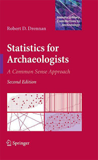
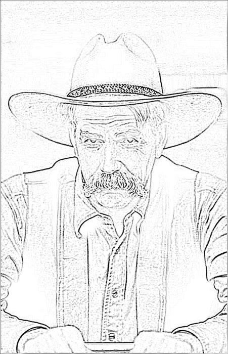

```{r setup, echo=FALSE, purl=FALSE, message = FALSE}
library(dplyr)
library(magrittr)
library(knitr)
library(kableExtra)
```

# Preface {-}

These notes, intended to serve as a guide to implementing Drennan's *Statistics for Archaeologists* (@Drennan_2009) in R, are built upon David Carlson's [*R Companion to Statistics for Archaeologists*](https://sites.google.com/a/tamu.edu/dlcarlson/home/r-project/companion-guides). I have written the text and rewritten most of the code, but without the foundation - and inspiration - that he provided this document would not exist.

```{r echo = F, out.width= "35%", out.extra='style="float:right; padding:10px"'}

```

They primarily use Base R, with additional packages generally noted when used. This is not to say that these are the only - or even the most efficient - ways of carrying out these operations! However, they are the easiest to follow when learning both statistics and R because they are (relatively) transparent; largely for this reason you won't find much of the so-called [*tidyverse*](https://tidyverse.org/) here, though it is indubitably a useful and often efficient way to use R. One major exception is the **dplyr** package (@Wickham_2018), which I have come to rely on for efficient data wrangling (see my intro to [Data Wrangling for Archaeology](https://dcontre.github.io/DataWrangling_notes/introduction.html)) and occasionally use here. A few other packages are added for select chapters; I have tried to confine this to the beginning of each chapter so that you can easily see which packages are being loaded.

Please note that you will not find much explanatory text about the concepts involved in each chapter here either - Drennan provides that. Rather, this text focuses on how to implement in R the kinds of analysis and visualization of archaeological data that Drennan describes. 

For a brief introduction to installing and managing R, see the first few sections ('Home' / 'Before We Start' / 'Intro to R') of this Data Carpentry lesson [*Data Analysis and Visualization in R for Archaeologists*](https://carpentries-incubator.github.io/R-archaeology-lesson/index.html) (warning: contains *tidyverse*). I have adapted much of the latter part ('Starting with Data' / 'Manipulating Data' / 'Visualizing Data') to our purposes; that revised lesson can be found [here](###add link###) (warning: still contains *tidyverse*...but not uncritically). 
For a collection of R-for-archaeology resources, see [here](###add link#r-for-arch###). 

# To do {-}
- check code; rewrite based on Baxter 2015 code
- **janitor** version of crosstabs and marginal totals? `adorn`
- add asides - e.g. on boxplots, etc 
  - make these separate workshop pages? 
    - Daegling on resampling 
    - more intro/pointer to other analytical methods?
    - Otarola-Castillo & Torquato on Bayesian methods
    - Codding & Brewer on count regression 
    - Ruiz-Giralt on compositional data
    - something on isotope data? 
    - logistic regression / model fitting
- rework spatial sampling chapter & problem set
- add (hidden?) tidyverse versions? 
- replace dplyr::recode with dplyr::case_when or forcats::fct_recode

# Batches of Numbers (Ch. 1)

```{r}
library(aplpack)
library(psych)
```

First re-create Table 1.8 Areas of 29 Sites in the Kiskiminetas River Valley. Although often you'll read existing data into R, there are also various ways to build tables/datasets in R. Here we'll use `data.frame()`, providing the name of the column/variable and the values with which to populate it. Note that adding more columns is as simple as adding another variable name and another set of values...but the number of values must match the first (tables can't have ragged edges). 

```{r KRV}
KRV <- data.frame(Area=c(12.8, 11.5, 14, 1.3, 10.3, 9.8, 2.3, 15.3, 11.2, 3.4, 12.8,
                         13.9, 9, 10.6, 9.9, 13.4, 8.7, 3.8, 11.7, 1.7, 12.3, 11,
                         2.9, 10.7, 7.4, 8.2, 2, 2.2, 4.5))
KRV
```

Then produce a stem-and-leaf plot using these data...

```{r KRV stem}
stem(KRV$Area, scale=2)
```

...and a histogram.  

```{r KRV hist}
hist(KRV$Area, breaks=15, col="darkgray", right=F)
```

You've just recreated Drennan's Fig. 1.2.


## Import the Scraper data.

Often you'll want to read an existing table (.xls, .csv, .txt, etc.) into R. Get used to figuring out where files live on your hard drive, and learn how to access the filepath (shift + rightclick on Windows; Option + Command + C on Mac). 
Note that the filepath can be either absolute ("where this lives on this machine") or relative ("where this lives in this folder"). The former will never get lost (unless you move the file or rename folders), while the latter risks getting lost but is more portable.

```{r scraper data}
scrapers <- read.delim("data/Drennan_datasets/scrapers.txt",
                       header=T)
```

You'll use `read.delim()` for tab-delimited; `read.table()` or `read.csv()` are comparable for other data structures. (There are R packages that also enable reading data with more complex formats - Excel tables or Google sheets, most commonly.). Get used to examining the structure of any data file so that you can figure out how to use it.  There are various tricks for this - select + spacebar on a Mac, or TextEdit (included w/ the OS; [TextWrangler and its spawn, BBEdit](https://www.barebones.com/products/bbedit/) are free and better); on a PC try the free utility [Notepad++](https://notepad-plus-plus.org/).

```{r}
scrapers
#examine the whole batch
stem(scrapers$Length, scale=1.5)
```

An alternative (in R there are often several) stem-and-leaf plot is available from the package 'aplpack'.  Install this package using either R-Studio's convenient interface or the command line.

```{r eval=F}
#uncomment the below to run this line
# install.packages("aplpack", repos="https://cran.rstudio.com/")
```

Alternatively, in R Studio, use the 'Install' command in the 'Packages' tab of the 'Files / Plots / Packages / Help' pane.
Then you can load the package (and R will automatically load any other packages upon which this one depends):

```{r load-package}
library(aplpack) 
#or 
require(aplpack)
```

Then you can use the functions that are available in that package, e.g.:
```{r stemleaf}
stem.leaf(scrapers$Length) 
```

You can also run an individual function from a package without loading that package by specifying the package when you call the function:
```{r run-package-code}
aplpack::stem.leaf(scrapers$Length)  
```

You may want to know just how `stem.leaf()` is different than `stem()`.  Remember that `?` is always an option, and should be used early and often.

``` {r}
?stem.leaf
```

With the data in hand and having looked at it in aggregate, it may be useful to expore it further, for instance by spliting the batch by site and/or by material and examining it again.

```{r subset}
#make two subsets, by site
PRCscrapers <- subset(scrapers, Site == "Pine Ridge Cave") 
# here these are subsetted and assigned to a new object
PRCscrapers #which you can examine

WFscrapers <- subset(scrapers, Site == "Willow Flats")

#back-to-back stem and leaf plot to easily compare the two sites visually
stem.leaf.backback(PRCscrapers$Length,WFscrapers$Length, trim.outliers = F)
```

Reordering data can also be a useful exploratory tool.
```{r order}
#e.g., by site
scrapers[order(scrapers$Site, scrapers$Length),]

#or by material type
scrapers[order(scrapers$Material, scrapers$Length),]
```

Note that since we are *not* writing these to an object, the result is only temporary (we have not altered 'scrapers' nor assigned the re-ordered data to a new object).

Subsetting by material can also be useful.
```{r}
chertscrapers <- subset(scrapers, Material == "Chert")  
# here the results *are* assigned to a new object, which you can then examine
chertscrapers

flintscrapers <- subset(scrapers, Material == "Flint")

#back-to-back stem and leaf plot
stem.leaf.backback(chertscrapers$Length, flintscrapers$Length, trim.outliers = F)

#note that this could also be accomplished without creating new objects
stem.leaf.backback(subset(scrapers, Material == "Chert")$Length,
                   subset(scrapers, Material == "Flint")$Length, trim.outliers = F)
```

# The Level or Center of a Batch (Ch. 2)

Build a data frame containing the flake data that Drennan uses (yes, I could give you the data, but it's useful to understand where data frames come from). Note that for our 'Context' column R will recycle the value we specify to populate all the rows; this means that you can specify the number of values that matches other columns *or* a single value. We'll build separate data frames for each pit, and then stick them together (`rbind()` binds data frames by stacking them, adding rows and maintaining the same number of columns; `cbind()` by extending them, adding columns and maintaining the same number of rows).

```{r flakes}
Pit1 <- data.frame(Context="Pit 1", Weight = c(9.2, 12.9, 11.4, 9.1, 28.6, 10.5, 
                                             11.7, 10.1, 7.6, 11.8, 14.2, 10.8))
Pit2 <- data.frame(Context="Pit 2", Weight = c(11.3, 9.8, 14.1, 13.5, 9.7, 12, 7.8,
                                             10.6, 11.5, 14.3, 13.6, 9.3, 10.9))

# then stick them together
Flakes <- data.frame(rbind(Pit1, Pit2))
Flakes
```

Calculate summary statistics.

```{r summarizing-pits}
mean(Pit1$Weight)
median(Pit1$Weight)
mean(Pit2$Weight)
median(Pit2$Weight)
by(Flakes$Weight, Flakes$Context, mean)
by(Flakes$Weight, Flakes$Context, median)

#trimmed means
mean(Pit1$Weight, trim = .1)
mean(Pit2$Weight, trim = .1)
#or
by(Flakes$Weight, Flakes$Context, mean, trim = .1)
```

To examine batches with multiple peaks, we'll create another data frame.

```{r multiple peaks}
BlackSmith <- data.frame(Area = c(18.3, 18.8, 16.7, 6.1, 5.2, 21.2, 19.8, 4.2, 18.3,
                                3.6, 20.0, 7.5, 15.3, 26.8, 5.4, 18.7, 6.2, 7.0, 20.7,
                                18.9, 19.2, 6.7, 19.1, 23.4, 4.5, 16.2, 5.6, 17.5,
                                5.9, 6.7, 4.9, 17.9, 15.0, 13.6, 5.4, 5.8))
BlackSmith

#examine with stem-and-leaf plot a la Table 2.2
stem.leaf(BlackSmith$Area, trim = F, unit = .1)

#or histogram
hist(BlackSmith$Area, breaks = 10)

#separate summary stats for the two batches
by(BlackSmith$Area, BlackSmith$Area > 10, mean)
by(BlackSmith$Area, BlackSmith$Area > 10, median)
```

# The Spread or Dispersion of a Batch (Ch. 3)

```{r summarizing-flakes}
flakes <- read.delim("data/Drennan_datasets/flakes.txt")
summary(flakes)

#Note that our column names (for 'flakes') have gone a bit funny
#but those are easy to fix 
colnames(flakes)  #examines existing 
colnames(flakes) <- c("Context", "Weight")  
#overwrites; note that these change only in our R object, *not* in the original .txt file. 
```

If you want to write out an R object as file for use elsewhere, that's easily accomplished:
``` {r writing files}
write.csv (flakes, "data/Drennan_datasets/out/flakes.csv")
```

Remember some of the techniques we've previously used to explore data; they're applicable here also.

```{r explore}
#subset flakes by pit
Pit1 <- subset(flakes, Context == "Pit 1")
Pit2 <- subset(flakes, Context == "Pit 2")
#reorder by weight
Pit1 <- Pit1[order(Pit1$Weight, decreasing = T),]
Pit2 <- Pit2[order(Pit2$Weight, decreasing = T),]

```

Back to exploring data as Drennan does:

```{r}
by(flakes$Weight, flakes$Context, summary)
#you can also use summary - and other tools - on individual columns
summary(Pit1$Weight)
range(Pit1$Weight)
IQR(Pit1$Weight)  #calculate the interquartile range (or midspread)
```

Note that quartiles can be calculated in various ways - see `?IQR` - so will vary for small samples.  The result for Pit 1 will not quite match Drennan's.

```{r}
IQR(Pit2$Weight)
```

The functions `var()` and `sd()` will give you the variance and the standard deviation.  You can also calculate these from scratch following Drennan.

To recreate Drennan's Table 3.2, we can take advantage of the ease with which R lets us repeat an operation for an entire vector.

First we calculate the deviations from the mean (wrapping that calculation in `round()` in order to round the result to 2 decimal places).  Note that by specifying a new column name ("Deviations") we create that column and populate it at the same time.

```{r}
Pit2$Deviations <- round((Pit2$Weight - mean(Pit2$Weight)), 2) 
#Then calculate the squared deviations, using the new "Deviations" column
Pit2$SquaredDeviations <- round(((Pit2$Deviations)^2), 2) 
Pit2 #Our Pit2 object now resembles Drennan's Table 3.2
```

If you want to make sure that our calculations match Drennan's, calculate the bottom row (we won't add these values to Pit2, but can easily inspect them)

```{r}
mean(Pit2$Weight)
sum(Pit2$Deviations)
sum(Pit2$SquaredDeviations)

#moving on to calculate the variance
sum(Pit2$SquaredDeviations) / (nrow(Pit2) - 1)
#or more simply (with some difference due to rounding error)
var(Pit2$Weight)
#by taking the square root of the variance we can derive the standard deviation
sqrt(sum(Pit2$SquaredDeviations) / (nrow(Pit2) - 1)) 
sd(Pit2$Weight)
```

Calculating the trimmed standard deviation requires deriving a Winsorized batch.  This is not available in Base R (that is, R as loaded), but is available in the **psych** package.

```{r results='hide'}
#uncomment as needed
# install.packages("psych", repos="https://cran.rstudio.com/")
```

This uses a slightly different method of Winsorizing than Drennan (replacing the trimmed values with the quartiles defined by the trim), so to approximate his results we use a 9% rather than a 5% trim.
We can then, following Drennan, calculate the Winsorized variance.

```{r winsorize}
# uncomment the below if needed

Pit1$Winsorized <- winsor(Pit1$Weight, trim = .09) 
Pit1$WinsorizedDeviations <- round((Pit1$Winsorized - mean(Pit1$Winsorized)), 2)
Pit1$WinsorizedSquaredDeviations <- round(((Pit1$WinsorizedDeviations)^2), 2)
#calculate Winsorized variance
sum(Pit1$WinsorizedSquaredDeviations) / (nrow(Pit1) - 1)

#and the trimmed standard deviation
sqrt(((nrow(Pit1) - 1) * sum(Pit1$WinsorizedSquaredDeviations) / 
        (nrow(Pit1) - 1)) / (nrow(Pit1) - 3))
#or rather than calculate it from scratch:
winsor.sd(Pit1$Weight) #should be the same!
```

The data you'll need for the Ch.3 Practice is available as a .txt file. Before we explore the data, let's use it to explore how to index data in R using the `[` operator. 
When using `[`, the comma separates row and column indices, so `[2,3]` specifies 'Row 2, Column 3'; `[,-1]` specifies all rows, and drops ('-') column 1.

```{r}
nanxiong <- read.delim("data/Drennan_datasets/Nanxiong.txt", header = T)
head(nanxiong) #use `head()` to look at the data without printing the whole table
```

When you examine the file you'll note that it has an extraneous leading column (row numbers). It's not doing any harm, but provides an opportunity to learn how to index data in R. Remove that extraneous column by selecting the other columns using the `[` operator.

```{r eval = F}
# '[' selects from an R object
nanxiong[,c(2,3)] # columns 2 and 3
#or
nanxiong[,2:3] # columns 2 through 3
#or
nanxiong[,-1] # not column 1

#or, alternatively by column name

nanxiong <- nanxiong[c("Period","Area")]
```

You could also specify this when importing the file
```{r}
read.delim("data/Drennan_datasets/Nanxiong.txt", header = T)[,2:3] 
```

Note that you would read this command as "select columns 2 through 3 of this file", which is subtly different than `[,c(2,3)]` - "select columns 2 and 3". 

# Comparing Batches (Ch. 4)

First make some useful data - post hole diameters at the Black and Smith sites.

```{r}
BSPosts <- data.frame(Site = c(rep("Black Site", 13), rep("Smith Site", 15)),
                      Diameter = c(9.7, 9.2, 12.9, 11.4, 9.1, 44.6, 10.5, 11.7, 11.1,
                                 7.6, 11.8, 14.2, 10.8, 20.5, 17.2, 15.3, 15.9, 18.3,
                                 17.9, 18.6, 14.3, 19.4, 16.4, 18.8, 15.7, 18.9, 16.8,
                                 8.4))
head(BSPosts)
summary(BSPosts)

#You already have some tools for comparing the two sites
by(BSPosts$Diameter, BSPosts$Site, summary)
#somewhat more thorough, using the 'Hmisc' package (if not particularly informative in this case)
by(BSPosts$Diameter, BSPosts$Site, Hmisc::describe) 
#or (see ?fivenum)
by(BSPosts$Diameter, BSPosts$Site, fivenum) 

```

Comparing things in more visual ways is often preferable, especially as datasets get larger.  Drennan introduces box-and-dot plots as an important basic tool for this. 

```{r}
#Creating a box-and-dot plot (or boxplot) is easy, but aggregates all of our data.
boxplot(BSPosts$Diameter, notch = F, log = "", col = 8, ylab = "Diameter")
```

In Fig. 4.1 Drennan plots only post hole diameters from the Smith site, which we can replicate by doing some selection with `[` on our `BSPosts` object. We can do this either by subsetting to create a new object and then using that in `boxplot()`, or by wrapping the subsetting step into our `boxplot()` command; both are illustrated here. The former is easier to read but involves more typing and contributes to the proliferation of objects in your working environment (note that if you don't want these around, you can get rid of them using `rm()`).

```{r}
SmithPosts <- BSPosts[BSPosts$Site == "Smith Site",]

boxplot(SmithPosts$Diameter, notch = F, 
        log = "", col = 8, ylab = "Diameter", ylim = c(6,28)) 
```


```{r}
boxplot(BSPosts[BSPosts$Site == "Smith Site",]$Diameter, notch = F, 
        log = "", col = 8, ylab = "Diameter", ylim = c(6,28)) 
```

The y-axis will default to a bit more than the range of the data we're plotting, so if (as Drennan does in Fig.4.1) we want to see the diameters from the Smith Site within the range of the whole dataset, we have to specify the `ylim` parameter (`c(6,28)` above creates a two-item vector in which the first element is used as the minimum and the second as the maximum).


Of course, the point is to compare different sites, as Drennan does in Fig. 4.2. Note the "formula" input (`Diameter ~ Site`), which refers to columns/variables of the data frame specified in the `data` argument. The formula should be read as "diameter by site" - that is, diameter on the y-axis and site on the x-axis.

```{r}
#use the '~' operator 
boxplot(Diameter ~ Site, data = BSPosts, col = 8, xlab = "Site", ylab = "Diameter")
```

Drennan highlights the fact that there are multiple aspects of post-hole diameters that we might want to compare.  The two sites clearly have different median post-hole diameters.  But what if we want to compare the *distributions* of post-hole diameters at each site?
To remove the level, we calculate the median post-hole diameter for each site, and then subtract that from each value (asking, in effect, "how far is each value from the median for that site?").

```{r}

#calculate the median diameter for each site
Smith_PostMed <- median(BSPosts[BSPosts$Site=="Smith Site",]$Diameter)
Black_PostMed <- median(BSPosts[BSPosts$Site=="Black Site",]$Diameter)
Smith_PostMed
Black_PostMed

#subtract the appropriate median from each value
BSPosts$nolevel <- ifelse(BSPosts$Site=="Black Site", BSPosts$Diameter - Black_PostMed,
                          BSPosts$Diameter - Smith_PostMed) 
```

Here we have used `ifelse()` to create a new column by subtracting the appropriate median - if 'Site' is "Black Site", then subtract 11.1 from the diameter; otherwise (i.e. if it's "Smith Site") subtract 17.2. The `ifelse()` function - check `?ifelse` describes a test ("does the value of Site = 'Black'?"), then specifies what to do if the test produces a true answer (if "yes", then subtract `Black_PostMed` from the value in the 'Diameter' column) or a false one (if "no", then subtract `Smith_PostMed` from the value in the 'Diameter' column). Keeping in mind the median values (Black = `r Black_PostMed`; Smith = `Smith_PostMed`), examine your results (the newly-calculated 'nolevel' column) and make sure that they make sense. 

```{r}
head(BSPosts)
```


Then, to produce Drennan's Fig. 4.3

```{r}
boxplot(nolevel ~ Site, data = BSPosts, col = 8, xlab = "Site", 
        ylab = "Diameter - No Level")

```

The next step is to remove the spread by reducing it to one (dividing by the midspread).
We'll do this for each site separately, looking at a more efficient way of standardizing in the process - using `scale()` rather than doing the calculations ourselves. Using `scale()` we can standardize by either the median and the IQR, or by the mean and the standard deviation (the latter are referred to as Z-scores).  

```{r}

#subset by site
BlPosts <- BSPosts[BSPosts$Site == "Black Site",]
#add the variable "Scaled"
BlPosts$Scaled <- scale(BlPosts$Diameter, center = median(BlPosts$Diameter), 
                        scale = IQR(BlPosts$Diameter))
#add z-scores
BlPosts$Z <- scale(BlPosts$Diameter)

#and the same for the Smith Site
SmPosts <- BSPosts[BSPosts$Site == "Smith Site",]
SmPosts$Scaled <- scale(SmPosts$Diameter, center = median(SmPosts$Diameter), 
                        scale = IQR(SmPosts$Diameter))
SmPosts$Z <- scale(SmPosts$Diameter)

#put the data back together
BSPosts <- data.frame(rbind(BlPosts, SmPosts))
#and examine it
head(BSPosts)
```

We can now build the two parts of Drennan's Fig. 4.4.

```{r}
boxplot(Scaled ~ Site, data = BSPosts, col = 8, xlab = "", ylab = "Scaled Diameter") 
```

The empty quotes in `xlab = ""` specify that we don't want to label the x-axis (it would be redundant, since we have labels for "Black Site" and "Smith Site")

Then, to produce a reasonable approximation of the back-to-back stem-and-leaf plot that Drennan does:

```{r}
aplpack::stem.leaf.backback(BlPosts$Scaled, SmPosts$Scaled, trim.outliers = F, unit = .1, m = 2) 
```


# The Shape or Distribution of a Batch (Ch. 5)

First we'll need some data on volumes of Bell-Shaped Storage Pits at the Buena Vista and Buenos Aires Sites.

```{r pits}
BVPits <- data.frame(Volume = c(1.23, 1.48, 1.55, 1.38, 1.10, 1.02, 1.29, 1.32, 1.35, 
                              1.65, 1.39, 1.40, 1.12, 1.46, 1.24, 1.34, 1.21, 1.45, 1.51))
aplpack::stem.leaf(BVPits$Volume, unit = .01)

BAPits <- data.frame(Volume = c(1.22, 1.64, 1.16, 1.07, 1.50, 1.84, 1.37, 1.15, 1.29, 
                              1.32, 2.03, 1.17, 1.04, 1.43, 1.11, 1.40, 1.26))
aplpack::stem.leaf(BAPits$Volume, unit = .01, trim.outliers = F)
```

Using those stem-and-leaf plots, compare the symmetry of storage pit volumes from the Buena Vista Site with the asymmetry of the pit volumes from the Buenos Aires Site.

Drennan experiments with seven different transformations.  We'll produce those all at once, using `transform()`.

```{r transform}
#transform the pit volume data in various ways
BVPits <- transform(BVPits, Vsqrt = sqrt(Volume), Vlog = log(Volume), VInv = -1/Volume,
                    VInvsq = -1/Volume^2, V2 = Volume^2, V3 = Volume^3, V4 = Volume^4)
BVPits  #examine the result
```

You'll note from Fig. 5.1 that Drennan also examines the results by producing stem-and-leaf plots and boxplots for each of the transformed variables. We'll use the powerful-but-confusing `apply()` function to do this, mostly just so that you can become aware of its existence (think about other ways you might do this). As `?apply` will tell you if you can decipher it, `apply()` takes an input array (a type of data structure; conveniently a data frame is similar to a two-dimensional array) and applies a function to one of its margins. In the case below, we specify that we'd like the `stem.leaf()` function - with some arguments that we include (e.g., `trim.outliers = F`) - applied to each column (`MARGIN = 2`) in `BVPits`. 

```{r plot transformed}

#Use apply() to have stem.leaf applied to each column
apply(BVPits, 2, aplpack::stem.leaf, trim.outliers = F, 
              depths = F, style = "bare")
```

We can also make a boxplot of these transformed variables.

```{r}
boxplot(BVPits)
```

This doesn't look like Drennan's boxplot, because he standardized the data before plotting into order to make the shapes of the distributions easily comparable.

```{r standardize}
#standardize using median and midspread, then plot again
BVStandard <- apply(BVPits, 2, function(x) scale(x, center = median(x), scale = IQR(x))) 
#This uses apply() as above and scale() as you saw in Ch.4
BVStandard
boxplot(BVStandard)
abline(h = c(-.5, .5), lty = 2) #add horizontal lines to the plot using abline()
```

You can repeat this with the second dataset (using fewer transformations), as Drennan does to build Fig. 5.2.  

```{r second dataset}
BAPits <- transform(BAPits, Vsqrt = sqrt(Volume), Vlog = log(Volume), 
                    VInv = -1/Volume, VInvsq = -1/Volume^2)
boxplot(BAPits)
BAStandard <- apply(BAPits, 2, function(x) scale(x, center = median(x), scale = IQR(x)))
boxplot(BAStandard)
abline(h=c(-.5, .5), lty = 2)
```

If you haven't already noticed in reading `?boxplot`, it's possible to make these plots much prettier.  In any R plot just about every parameter is manipulable (color, line weight, fill, background, font, etc).

```{r ugly boxplot}
#So, for instance, if you wanted to make a considerably uglier boxplot...
boxplot(BAStandard, col = "salmon", border = "limegreen", outpch = 23, outbg = "salmon",
        main = "Ow, my eyes", col.main = "limegreen", col.axis = "salmon",
        xlab = "Transformations", col.lab = "salmon", cex.lab = 1.2)  
```

Have a look and figure out which of the parameters added here have done what to the plot - this is knowledge that will come in very handy later.

When - not if! - you want to explore boxplots and histograms of archaeological data a bit further, you can find a bit more [here](###add link to pretty boxplots###).

# Categories (Ch. 6)

First download and import the data (remember that if your copy of 'sherds.csv' does not occupy the same relative location you will need to modify the filepath here to match the location of your local copy of sherds.csv).

```{r read}
sherds <- read.csv ("data/Drennan_datasets/sherds.csv", stringsAsFactors = T)
```

Rather than look at the whole dataset - it doesn't all fit in the console anyway - let's use `head()` to examine just the first several rows (note that `tail()` is analogous).
```{r}
head(sherds)
```

Here we are dealing with a *categorical* variable rather than a *numeric* one (and this is a kind of data that both archaeologists and anthropologists very often have).  In R, this means that the columns of data will be *factors*. We can check that by using `str()` to examine the data. 

```{r factors}

str(sherds$Site) 

levels(sherds$Site) 

```

The 3 levels that `str()` references are the possible values of the factor - i.e., the categories. We can look at those levels directly - and you'll notice that since R defaults to ordering factors alphabetically, our ordering doesn't match Drennan's.  For our interests here this matters not at all, but it's useful to understand how to reorder a factor.

```{r}
sherds$Site <- factor(sherds$Site,
                      levels(sherds$Site)[c(3,2,1)])  
#reorder by re-making sherds$Site as a factor, ordering the levels in the process. 
```

If you want to know what you're reordering *to*, just run that piece of code to check: 
```{r}
levels(sherds$Site)[c(3,2,1)]
#since we're not assigning the result to an object, running this has no consequences beyond displaying the result
```

Note that the order of factor levels is basically arbitrary - but can effect, e.g., the order in which categories will appear in data plots, so it's useful to be able to manipulate.

Note also that there is an importantly *wrong* way to do this, which we can diagnose as problematic by using the `summary()` function to count up all of the occurences of each value (i.e., how many sherds from each site). If you take the seemingly reasonable step of reordering the levels by simply overwriting them, you scramble your data values. Examing the alarming 'before' and 'after' outputs of `summary()` here, and keep in mind that if you want to re-order factors, this is *not* the way to do it!

```{r}
summary(sherds$Site)
levels(sherds$Site) <- levels(sherds$Site)[c(3,2,1)]
summary(sherds$Site)
```
The easiest way to restore your `sherds` object is to re-run the line above that reads in the object - and make sure that you don't accidentally run the lines immediately above and re-scramble it.

```{r}
sherds <- read.csv ("data/Drennan_datasets/sherds.csv", stringsAsFactors = T)
sherds$Site <- factor(sherds$Site,
                      levels(sherds$Site)[c(3,2,1)]) 
```

Now we can begin to explore the data, in various ways. The `summary()` function gives us an overview, and we can use `table()` to summarize just the counts of sherds from each site.

``` {r summarizing-sherds}
 #first simply
summary(sherds) 
table(sherds$Site) 
```

To produce Table 6.2, we need to calculate and display frequencies and proportions. We'll do that by building a table as above, and then using `addmargins()` to add a row sum. We can also use `prop.table()` to calculate relative proportions, but it won't do the counting that `table()` does, so needs to operate on the output of `table()`. 

```{r freq & prop}

SiteTable <- table(sherds$Site)
addmargins(SiteTable) #table with row sum

#run prop.table converting proportions to %, adding a row sum, and rounding 
round(addmargins(prop.table(SiteTable))*100, 2)
#combine the two tables
sherdsbysite <- rbind (addmargins(SiteTable), 
                       round(addmargins(prop.table(SiteTable))*100, 2))
#add row names
rownames(sherdsbysite) <- c("Frequency", "Proportion")
sherdsbysite
```

It should be clear that you could produce Table 6.3 by doing the same but with `sherds$Style`.

Table 6.4 involves cross-tabulating the two variables - asking whether the frequencies and proportions of different ceramic styles vary at different sites.  If you've used pivot tables in Microsoft Excel you may recognize this sort of summarizing by different variables - there's considerable conceptual overlap.

``` {r tables}
table(sherds$Site, sherds$Style)
```

Using `t()` will transpose the table, producing something that matches the 'Frequencies' portion of Table 6.4. 

```{r}
t(table(sherds$Site, sherds$Style))  
```

We can do the same thing more elegantly using the `xtabs()` function.

```{r xtabs}
Xtable <- xtabs(~Style + Site, data = sherds)
Xtable
#convert XTable to a data frame
Ftable <- data.frame(Xtable)
Ftable  
```

The Ftable object that we've just produced is a compact version of 'sherds'; we didn't need to produce this but you might well encounter data in this format that you'd then want to manipulate with `xtabs()`, like so:

```{r}
xtabs(Freq~Style+Site, data=Ftable)
```

```{r barplots}
#various ways of plotting 'sherds' (first making a crosstab), using barplot
barplot(Xtable, ylab = "Frequency")	# Stacked bar graph 
```

A stacked bar graph is, in this case, not very useful - unstacked bars allow better comparison.

``` {r}
barplot(Xtable, ylab = "Frequency", beside = T) # Side-by-side bar graph
```

Several more options that you should compare. What are the advantages/disadvantages to each? What information is each good at conveying; which comparisons does each facilitate?

``` {r more barplots, fig.show='hide'}

barplot(Xtable, ylab  =  "Frequency", beside  =  T, legend.text = T) # with legend
barplot(base::t(Xtable), ylab = "Frequency")	# Stacked bar graph, flip rows/columns
barplot(base::t(Xtable), ylab = "Frequency", beside = T) # Side-by-side bar graph, rows/columns flipped
barplot(base::t(Xtable), ylab = "Frequency", beside = T, legend.text = T) # with legend
barplot(base::t(Xtable), beside = T, legend.text = T, 
        args.legend = list(x = "topleft")) #moves the legend
# The next two use percentages to match Figure 6.1
barplot(base::t(prop.table(Xtable, 2)*100), ylim = c(0,75), ylab = "Percent", beside = T,
        legend.text = T)
barplot(prop.table(Xtable, 2)*100, ylim = c(0,75), ylab = "Percent", beside = T,
        legend.text = T)
```

We can also reproduce Fig. 6.1 by putting these in the same plot.  The simplest way to do this uses base R graphics and divides the plotting space into multiple panes; each subsequent plot command then populates the next pane in the sequence.
If we want to label the bars as Drennan does, we can then grab the values of the midpoints of the bars.

```{r multiplots}
#set the mfrow parameter in par() to one rows and two columns
par(mfrow  =  c(1,2))  
barplot(base::t(prop.table(Xtable, 2)*100), 
        ylim = c(0,75), ylab = "Percent", beside = T)

midpts <- as.vector(barplot(base::t(prop.table(Xtable, 2)*100), 
                            ylim = c(0,75), ylab = "Percent", beside = T, plot = F))
#And the heights of the bars:
heights <- as.vector(base::t(prop.table(Xtable, 2)*100))
#...and then use those as coordinates for adding some text to the plot:
text(midpts, heights+2, labels = levels(sherds$Site), srt = 90, pos = 4, cex = .8) 
```

This may seem like more trouble than it's worth, but it turns out often to be quite useful to be able to figure out exactly where elements of a plot are, and place text accordingly.

```{r}
barplot(prop.table(Xtable, 2)*100, ylim = c(0,75), ylab = "Percent", beside = T)
midpts2 <- as.vector(barplot(prop.table(Xtable, 2)*100, 
                             ylim = c(0,75), ylab = "Percent", beside = T, plot = F))
heights2 <- as.vector(prop.table(Xtable, 2)*100)
text(midpts2, heights2+2, labels = levels(sherds$Style), srt = 90, pos = 4, cex = .8)
```

```{r dev off, results='hide'}
#to restore your plot space to normal (instead of having two panes), run:
# dev.off()
```

As we've seen with boxplots, it's easy to manipulate color as well.

```{r plot color}
barplot(base::t(prop.table(Xtable, 2)*100), ylim = c(0,75), 
        ylab = "Percent", beside = T, legend.text = T, 
        col = c("red", "green", "blue"), args.legend = list(x = "topleft"))

barplot(prop.table(Xtable, 2)*100, ylim = c(0,75), 
        ylab = "Percent", beside = T, legend.text = T, 
        col = c("red", "green", "blue"), args.legend = list(x = "topright"))
```

Bonus fun: it's often a good idea to add sample size to your plots. You can do this in various places/ways. If you're using `barplot()` and what to include it in the labels below each bar, the relevant argument is `names.arg =` (see `?barplot`). You can do this by calculating the sample size and adding the text yourself, or you can add an object with the sample size to your labels, so that if the sample size changes your plot stays up-to-date (it's a bit more hassle at first, but will save grief later).

```{r add-n}
#figure out the relevant sample sizes (total number of sherds/site)
#then make an object that pastes that together with some text
barnames <- paste(colnames(Xtable), "\n(n = ", colSums(Xtable), ")", sep = "")
#and use that object as an argument to names.arg
barplot(prop.table(Xtable, 2)*100, ylim = c(0,75), ylab = "Percent", 
        beside = T, legend.text = T, names.arg = barnames)
```


## Practice

The data for the Ch.6 Practice are in [AlAmadiyah.csv](data/Drennan_datasets/AlAmadiyah.csv).


# Samples and Populations (Ch. 7)

Drennan dwells at some length on sampling because it is so fundamental. It's important to remember that often our most basic concern with sampling is understanding the nature of the sample we have, and how it relates to the population in which we are interested - but a much more immediate and practical concern is how to efficiently draw random samples.  A simple but very powerful tool for doing this in R is `sample()`, which can replace the table of random numbers that Drennan discusses.

Suppose that you had gridded an area in 1 ha blocks and wanted to select a random sample of grid squares in which to collect cultural material, or crop varieties, or butterflies.  If the area you were studying was 10 km x 7.5 km, you would have 7500 ha to choose from [(10000 * 7500)/10000], from which you might want to sample only 100.
Perhaps the simplest way to sample these would be to assign a number to each hectare block within the grid, and then randomly select 100.

```{r sampling-grids}
grids <- sample(1:7500, 100) #randomly select 100 numbers from 1-7500, w/o replacement
#if you have reason to sample with replacement instead, use replace = TRUE in sample()
grids #by default these are ordered as selected
```

Probably - think about the practical realities of working your way around the landscape collecting samples - you'd find it more practical to order these sequentially.

```{r}
sort(grids) 
```

As Drennan (p85) is at pains to point out - and as you would be very wise to note! - *random* is not the same thing as *representative*.  The concepts underlying Drennan's discussion of random and nonrandom samples, sampling bias, and representativeness *are at least as important as any statistical technique*. As Drennan notes (p88), these are issues fundamental to inference generally, not just to statistical inference (i.e., you cannot avoid the need to think about these issues by simply eschewing statistics!).

Note that R code that generates random samples is very unlikely to draw the same number twice! So...if you run the code a second time, you're likely to get a different answer. If you want to, for illustrative purposes, makes sure that you always draw the same random number, use the `set.seed()` function. 

Compare the result of running both lines of code below two or three times to the result of running only the second line of code two or three times. 

```{r}
set.seed(42)
sample(1:7500, 100)
```


# Different Samples from the Same Population (Ch. 8)

While random samples are not necessarily representative, they often simplify the process of considering just how likely it is (or isn't) that a sample is representative.  This makes it possible to quantify how confident we can be about inferences made from such samples.  It also makes it possible to consider how likely particular *kinds/degrees* of nonrepresentativeness are to occur.

Drennan illustrates this with a table (8.1) of posthole diameters.
You can easily calculate n, $\mu$, and $\sigma$ (and they match what Drennan provides!)

```{r postholes, cache=T}
#postholes from Table 8.1
postholes <- c(10.4, 10.7, 11.1, 11.5, 11.6, 11.7, 12.2, 12.6, 12.9, 13.2, 13.7, 
               14.0, 14.3, 15.0, 16.4, 18.4, 20.3)
length(postholes)
mean(postholes)
sd(postholes)
```

What happens as we begin to sample this population of 17 posthole diameters?  We can easily construct a plot that illustrates the process Drennan describes of drawing single samples from this population.

We might begin by simply examining the data.  A plot of the density of data puts the values of our data (the measured posthole diameters) on the x-axis, and their frequency on the y-axis, with an estimated curve (a kernel density estimate, though you needn't worry about that for now) showing how common different values are.

```{r sampling-postholes}
plot(density(postholes), las = 1, xlim = c(7, 24), xaxp = c(7, 24, 17), ylim = c(0, .18),
     yaxp = c(0, .18, 9), lwd = 2)
abline(h = c(0:18/100), v = c(7:24), lty = "dotted", col = "lightgray") # add a grid
rug(postholes) #add a "rug" - tickmarks above the x-axis identifying individual samples
abline(v = mean(postholes), lwd = 2, col = "red") # add a vertical line at the mean
```

It's also useful to visualize the range of values that Drennan suggests might constitute acceptably accurate estimates of the mean. There's nothing magic about his error of +/- 3cm; it's just an arbitrary value that serves to illustrate how easy, or difficult, it might be estimate the mean.

```{r echo = -c(1:4)}
plot(density(postholes), las = 1, xlim = c(7, 24), xaxp = c(7, 24, 17), ylim = c(0, .18),
     yaxp = c(0, .18, 9), lwd = 2)
abline(h = c(0:18/100), v = c(7:24), lty = "dotted", col = "lightgray") 
rug(postholes) 
abline(v = mean(postholes), lwd = 2, col = "red") 
arrows(mean(postholes)-3, .02, mean(postholes)+3, .02, length = .1, angle = 90, 
       code = 3, lwd = 2, col = "blue") #arrows() adds to existing plot
```

You can see what Drennan describes by looking at the rug plot - the tick marks at the bottom of the plot indicating measured posthole diameters - and noting how many of those values fall within the range indicated by the blue line.  With a sample size of 1, as Drennan indicates, you can visually estimate that you would be reasonably likely to select a value that falls within the acceptable parameters.

If you wanted to evaluate this numerically as Drennan does, you could calculate the difference between each posthole diameter and the population mean:

``` {r}
postholes - mean(postholes) #note that this is vectorized 
```

As Drennan observes, and as you can see in the plot, postholes 1, 16, and 17 differ from the mean by more than 3cm.

Having explored the outcomes of drawing one sample from our population of 17 postholes, we can proceed to explore what happens when we draw larger samples.
That we do by drawing random samples with replacement.  We can subsequently consider - as Drennan describes - the distribution of the means of the samples we draw, paying particular attention to how many of them meet the criterion of falling within 3cm of the population mean.

Begin by establishing the basic plot:

```{r}
plot(density(postholes), ylim = c(0, .5), xlab = "Mean Diameter", 
     main = "Sampling Distributions")
abline(v = mean(postholes))
```

Then, draw samples of given sizes 500 times (similar to Drennan's "all possible samples of 2, samples of 3, etc" - but drawing only 500 rather than all possible), and create a kernel density plot for the aggregate of each sample size (added as lines of different colors to our basic plot).  

We do this with a very useful function called `sapply()`, which we use to perform the same operation over and over again (500 times here) - in this case, take a sample (with replacement) of specified size (first 2, then 3, then 4, then 10), from 'postholes', then take the mean of that sample. 

```{r echo = -c(4,5)}
samples2 <- sapply(1:500, function(x) mean(sample(postholes, 2, replace = T)))
mean(samples2)
sd(samples2)
plot(density(postholes), ylim = c(0, .5), xlab = "Mean Diameter", 
     main = "Sampling Distributions")
abline(v = mean(postholes))
lines(density(samples2), col = "red")
```

```{r echo  =  -c(4:6)}
samples3 <- sapply(1:500, function(x) mean(sample(postholes, 3, replace = T)))
mean(samples3)
sd(samples3)
plot(density(postholes), ylim = c(0, .5), xlab = "Mean Diameter", 
     main = "Sampling Distributions")
abline(v = mean(postholes))
lines(density(samples2), col = "red")
lines(density(samples3), col = "blue")
```

```{r echo = -c(4:7)}
samples4 <- sapply(1:500, function(x) mean(sample(postholes, 4, replace = T)))
mean(samples4)
sd(samples4)
plot(density(postholes), ylim = c(0, .5), xlab = "Mean Diameter", 
     main = "Sampling Distributions")
abline(v = mean(postholes))
lines(density(samples2), col = "red")
lines(density(samples3), col = "blue")
lines(density(samples4), col = "green")
```

```{r echo  =  -c(4:8)}
samples10 <- sapply(1:500, function(x) mean(sample(postholes, 10, replace = T)))
mean(samples10)
sd(samples10)
plot(density(postholes), ylim = c(0, .5), xlab = "Mean Diameter", 
     main = "Sampling Distributions")
abline(v = mean(postholes))
lines(density(samples2), col = "red")
lines(density(samples3), col = "blue")
lines(density(samples4), col = "green")
lines(density(samples10), col = "violet")
#add a legend to the final plot
legend("topright", c("Sample Size = 1", "Sample Size = 2", "Sample Size = 3", 
                     "Sample Size = 4", "Sample Size = 10"), lty = 1, 
                      col = c("black", "red", "blue", "green", "violet"), cex = .8)
```

The final plot shows that as the sample size increases from 1 (black) to 10 (violet) the distributions of the means of those samples change shape, becoming narrower and taller. That shape describes the distribution of the 500 means we took of samples of different sizes: it will always be centered on the population mean, and when those means are closer to the population mean and to each other, the shape will be taller and narrower. 
The means and standard deviations of the sample means (calculated along the way) provide another way of seeing the same thing: as the sample size increases from 1 to 10, the means remain similar, but the standard deviations shrink.
Note that with larger samples the means are more symmetrical than the original data distribution. *We shouldn't expect the shapes of these curves to match* - remember that the distribution of sample means should, especially as sample sizes get larger: 

1. be approximately centered on the *population* mean, and 
2. be normally distributed.  

The sample means converge on the population *mean*, not the population *distribution*; see Drennan's discussion of the central limit theorem (pp105-106).

Finally, calculate the standard error for different sample sizes.

```{r}
sd(postholes)/sqrt(c(2, 3, 4, 10))
```


# Confidence and Population Means (Ch. 9)

Drennan begins this chapter (p107) with two observations that are vital to archaeological use of any kind of statistics. 

>In real life...we do not know either the mean or the standard deviation of the population from which our sample is drawn. Indeed those are precisely the things we are trying to estimate on the basis of a sample.

>...instead of having one population and all the possible samples from it, we have one sample and [must] consider the possible populations it might have come from.

We are sampling from unknown populations, and using our samples to make inferences about those populations.  Justifying those inferences, and assessing the limits of what we can infer, is one of the most important things that we do.  This is equally true whether one uses quantitative data and statistics or not, but much harder to be explicit about without statistics.


Drennan does not provide specific measurements for the set of 100 projectile points that he uses for the examples in Ch.9, but if we make some assumptions about their distribution (not necessarily justifiable, but we can always explore the effects of changing our assumptions) we can simulate this dataset easily, since we know the mean and standard deviation.
If we assume that the population is normally distributed, we can use `rnorm()` - and if we have other ideas about the distribution we can easily generate samples from such distributions - see `?Distributions`.

```{r cache=T}
ppoints <- round(rnorm(100, mean = 3.35, sd = .5),1) #rounded to 1 decimal
ppoints
```

*Nothing* that we can do in R can address the issues of deciding whether the sample can be treated as unbiased for the purposes of the question(s) that you may want to ask. This is - as Drennan discusses on p108-109 - vital, but it is *entirely up to you and your brain*.


```{r}
#build a population with mean 3.25cm and standard deviation .5 cm
pp_pop <- rnorm(100000, 3.25, .5)
hist(pp_pop, 100) #examine the population
samples3.25 <- sapply(1:10000, function(x) mean(sample(pp_pop, 100, replace = T)))
hist(samples3.25, 100) #examine an approximation of the special batch 
```

This is the mean of a *lot* of samples from our population of mean 3.25cm and standard deviation .5cm, rather than "all possible" - but it makes the point nonetheless (compare to Drennan Figure 9.1).
We could repeat that process for the other special batches that Drennan plots in Figures 9.2 - 9.5. These show various distributions of means for the samples from populations with various means - and in all of them we can locate the mean of the sample we have: 3.35cm, and use the height of the histogram (frequency) to judge how likely it is that our sample, with its mean of 3.35 and standard deviation of .5, is to have come from that particular distribution of means.

Figure 9.6 represents the "batch consisting of the means of the populations from which a sample of 100 with a mean of 3.35 cm and a standard deviation of 0.50 cm might have come." 
Plotting this is mildly complicated; the main feature of interest (in R terms) below is that we strip our plot of axes (`axes = F`) in order to then rebuild the x-axis that we want, and then we add the SE bar (using `arrows()` for the bar and `mtext()` for the label; the latter is necessary because the label we want to add is in the plot margins rather than in the main area of the plot).  The complicated part - which you needn't follow unless you want to - is the use of `approxfun()` to generate a sequence of y-values that lets us fill the area under the curve (by using `polygon()`).

```{r out.height='70%'}
pop9.6 <- rnorm(100000, 3.35, .5/sqrt(100))
plot(density(pop9.6, bw = .01), xlab = "cm", ylab = "", main = "", axes = F)
axis(1, at = seq(3.175, 3.525, by =.025))
arrows(x0 = 3.35 - (.5/sqrt(100)), x1 = 3.35 + (.5/sqrt(100)), y0 = -2.5, 
       y1 = -2.5, col = "red", code = 3, length = .05, angle = 90, xpd=T)
mtext(1, 2.4, text = " +/- 1 SE", col = "red")
get.y <- approxfun(density(pop9.6, bw = .01)$x, density(pop9.6, bw = .01)$y)
polygon(x = c(3.3, seq(3.3, 3.4, .001), 3.4), y = c(0, get.y(seq(3.3, 3.4, .001)), 0), 
        density = 10, col = "red", angle = 0)
abline(v = 3.35, col = "red")
lines(seq(3.3, 3.4, .001), get.y(seq(3.3, 3.4, .001))) #re-draw black curve
```


## Student's *t*
Probabilities that population means fall w/in different ranges (following Drennan, bottom of p.118):
```{r}
diff(pt(c(-2, 2), df = 99))
diff(pt(c(-3, 3), df = 99))
diff(pt(c(-1, 1), df = 99))
```

It's straightforward to estimate the number of standard errors for a particular confidence level using *t* quantiles.
Either of the lines below will return a 90% confidence interval for a sample of 100.  In the first you have to figure out for yourself which quantile you need for your desired confidence interval; in the second you can plug in your desired confidence interval and let R do the arithmetic.

```{r}
qt(.95, df = 99)  
qt((.9+1)/2, df = 99)
```

Rim Diameter Measurements for a Sample of 25 Rim Sherds (Drennan Table 9.2):

```{r cache=T}
Rims <- c(7.3, 9.3, 11.6, 11.8, 12.2, 12.5, 12.9, 13.3, 13.4, 13.8, 14.0, 14.4, 14.8, 
          14.9, 15.6, 15.7, 15.8, 16.2, 16.5, 17.3, 17.7, 18.8, 19.4, 19.5, 21.0)
summary(Rims)
```


We can use the finite population corrector to illustrate the way that R makes it possible to build your own function to handle computations that you may do repeatedly. Just as `mean()` is an R function that performs a series of operations on an object, you can define your own function that performs a series of operations.  The  example here is based on Drennan p.123ff.

``` {r cache=T}
fpc <- function(std, n, N) {std/sqrt(n)*sqrt(1-(n/N))}
fpc
```

Here we've called the function `fpc` (for "finite population corrector"). We assign that name using `<-` as for any object, and then use `function()` to specify what inputs we expect the function to take (here three arguments: 'std', 'n', and 'N'), and what (in the `{ }` that follows) we then want the function to do with those inputs. 
When you define the function (i.e. run that line of code that assigns your function to a name), there is no output unless there is an error, but the function has been written into your workspace environment (you can check R Studio's 'Gobal Environment' tab, or run `ls()` to check). 

If you just type the function name in the console, R prints the definition of the function. To run it, you need to give it values for the necessary arguments, just as you would for `mean()` or anything else.  
The function that we've defined - `fpc` - takes three values (arguments): the standard deviation, the sample size, and the population size. As with any R function, you can either put the values in order or call them by name. 
We can test our shiny new function using the sample of 25 rim sherds: 

```{r}
fpc(N = 53, n = 25, std = 3.21)
```


"How large a sample do we need?" (Drennan, p.126)
```{r cache=T}
SampleSize <- function(sd, t, ER) {(sd*t/ER)^2} 
#where sd = standard deviation, t = Student's t, ER = error range
SampleSize(.9, 1.96, .5)
qt((.95+1)/2, df = 12)
SampleSize(.9, 2.18, .5)
qt((.95+1)/2, df = 15)
```

The chapter ends with a discussion of assumptions and robust measures. As you will remember, R has features for computing trimmed means and standard deviations. We can run through his example using the data in Table 9.3:

```{r}
#Weights of a Small Sample of Projectile Points:
PtWgt <- c(96, 37, 28, 34, 52, 18, 21, 39, 156, 43, 44, 19, 30, 108, 55, 
           24, 28, 47, 39, 31)
mean(PtWgt)
mean(PtWgt, trim = .15)
#remember that winsor.var requires the 'psych' package
winsor.var(PtWgt, trim = .17)
```

For the 'Practice' problems, you'll find a .pdf of Drennan p131 [here]('data/Drennan_datasets/Drennan_2009_p131.pdf').  Use Tabula to scrape the tables out of it, edit them as needed (putting all the data in a single column - what's an efficient way to do this?), and then you can address Drennan's questions.

<!-- If you are keen to do this all in R, you can use the **tabulapdf** package (I find this trickier than using the browser interface, because you can't see quite what you're doing with respect to the tables in the .pdf, but sometimes it's nice and efficient to keep everything in R.) -->

<!-- ```{r cache=T} -->
<!-- # library(tabulapdf) -->
<!-- # library(tabulizerjars) -->
<!-- drennan_Ch9tables <- extract_tables("data/Drennan_datasets/Drennan_2009_p131.pdf") -->
<!-- ``` -->

<!-- The result is a list (try `str(drennan_Ch9tables)`) of two matrices that you'll want to turn into two different tables.  The lines below index one element of the list (the `[[`), convert the extracted matrix to a character vector, and then make it numeric.  Clunkier than the GUI for Tabula, but worth knowing how to do... -->

<!-- ```{r} -->
<!-- table9.4 <- as.numeric(as.vector(drennan_Ch9tables[[1]])) -->
<!-- table9.5 <- as.numeric(as.vector(drennan_Ch9tables[[2]])) -->
<!-- ``` -->

<!-- What happened to the third table?  That's why I tend usually to use the Tabula GUI... -->

```{r tablesCh9, echo=F, include=F}
#Lengths of 40 Utilized Flakes from Chateauneuf-sur-Loire:
CsLFlakes <- data.frame(Length = c(4.7, 4.1, 8.0, 3.2, 9.7, 7.5, 5.7, 5.0, 6.8, 6.2, 9.3, 6.9, 
                                   7.3, 4.5, 3.9, 5.4, 3.5, 6.0, 8.3, 5.5, 4.3, 4.8, 5.6, 6.1, 
                                   5.9, 7.8, 8.1, 4.3, 4.7, 3.0, 6.1, 5.1, 6.5, 8.8, 7.4, 8.5, 
                                   6.3, 7.0, 5.3, 2.6))

#Diameters of 44 Mesolithic Hearths at Berwick-upon-Tweed:
BuTHearths <- data.frame(Diameter = c(0.91, 0.51, 0.76, 1.64, 0.85, 0.88, 0.72, 0.77, 0.69, 0.75, 
                                      0.80, 0.90, 0.58, 0.60, 0.70, 2.47, 0.84, 1.00, 1.03, 0.66, 
                                      0.76, 0.96, 0.74, 0.64, 0.62, 0.86, 0.84, 0.82, 0.93, 0.95, 
                                      0.56, 0.78, 0.89, 0.98, 1.08, 0.83, 2.13, 0.66, 0.62, 1.93, 
                                      0.68, 0.80, 0.74, 0.93))

#Zinc Content of 14 Obsidian Blades from a Prehistoric House at Huancabamba:
HuancabambaBlades <- data.frame(Zinc = c(53, 37, 60, 49, 66, 55, 41, 33, 82, 59, 48, 22, 74, 57))

```

# Medians and Resampling (Ch. 10) {#resampling}

Create a dataset to approximate the data underlying Drennan's Table 10.1.
```{r cache=T}
ClassicSites<-read.csv("data/Drennan_datasets/AllClassic.csv", 
                   header=T)[,-1] #[,-1] removes extraneous leading column of rownames
```

Compare Early Classic and Late Classic site areas with a boxplot, and by measures of central tendency. For the latter we can use the handy `aggregate()` function, which like `boxplot()` can take a formula input (the first use of `aggregate()` below can be read as "aggregate area by period, then calculate the mean for each group"). 

```{r}
boxplot(Area ~ Period, data = ClassicSites, names = c("Early Classic", "Late Classic"),
        ylab = "Area (ha)", boxwex = .25, col = "orange", outpch = 21, outbg = "orange")
aggregate(Area ~ Period, data = ClassicSites, mean)
aggregate(Area ~ Period, data = ClassicSites, median)
```

Bootstrap the median area of Early Classic sites, 10000 repetitions (using our old friend `sapply()`). Note how easy (and fast) it is to do this 10000 times, and think about what doing that by hand would look like; this is why resampling has become a more viable technique in the last few decades.

```{r cache=T}
EClassic <- ClassicSites[ClassicSites$Period == "Early Classic",]
MedianBootstrap <- sapply(1:10000, function(x) median(sample(EClassic$Area, replace = T)))  

#then plot a histogram of the results
hist(MedianBootstrap, breaks = 18, col = "grey", main = "", xlab = "Area medians (ha)")
#add vertical lines showing the medians of both bootstrapped samples and actual sites
abline(v = median(MedianBootstrap), col = "blue", lwd = 2)
abline(v = median(EClassic$Area), col = "red", lty = 2, lwd = 2)
```

We can calculate percentiles (to use as confidence intervals) using `quantile()`.

```{r}
quantile(MedianBootstrap, p=c(.01, .025, .05, .95, .975, .99))     

```

Using the .05 and .95 percentiles, then, we can be 90% confident that the population median lies between 24ha and 34ha.

Although we normally would use the Central Limit Theorem to find confidence intervals around the population *mean*, in principle we could bootstrap the mean too.

```{r}
MeanBootstrap<-sapply(1:10000, function(x) mean(sample(EClassic$Area, replace = T))) 
hist(MeanBootstrap, breaks = 20) 
abline(v = mean(MeanBootstrap), col="blue", lwd = 2)
abline(v = mean(EClassic$Area), col = "red", lty = 2, lwd = 2)
```

# Categories and Population Proportions (Ch. 11)

In Ch. 11 Drennan looks at standard deviation and standard error of proportions (using the example, from Ch.9, of the 100 projectile points of which 13 are obsidian).
We can make a series of functions for these calculations, partly for practice with functions and partly to follow the logic of generating confidence intervals around proportions.

1. make a function for standard deviation of a proportion ($s = \sqrt{pq}$), where *p* = proportion and *q = 1-p*.
2. make a function for standard error of a proportion ($SE = \frac{\sigma}{\sqrt{n}}$), where since the population standard deviation ($\sigma$) is unknown, we use the sample standard deviation (*s*, calculated in Step 1) and *n* = sample size.

```{r cache=T}
SDP <- function(p, q) {sqrt(p*q)}  # function for standard deviation of a proportion
SDP(p = .13, q = .87)  

SEP_v1 <- function(s, n) {s/sqrt(n)}   # function for standard error of a proportion
SEP_v1(s = .3363, n = 100)

#combine these functions and calculate q in the function
SEP <- function(p, n) {(sqrt(p*(1-p))) / sqrt(n)}
SEP(p = .13, n = 100)
```

The result (.0336) can be used as 1 standard error range - i.e. we can be about 66% confident that 13% ± 3.4% is the population proportion of obsidian points.  

We might want to be more than 66% confident, and in any case it probably is more practical to be able to calculate the confidence interval for a specific desired confidence level (e.g., "I'd like to know the proportion with 90% certainty.").  To that end we can build another function, where we adjust an error range for a desired confidence interval using Student's *t* (using `qt()` as in Ch.9). Here SEP = standard error proportion, ci = desired confidence interval, and *n* = sample size. Confusingly, we now 

```{r cache=T}
SEPconf <- function(SEP, ci, n) {SEP * (qt((ci+1)/2, df = (n-1)))} 
SEPconf(SEP = .0336, ci = .95, n = 100)
```

Note that our function requires the standard error proportion as input. We can make something more intuitive to use by instead including the calculation for SEP (see above) in the function. Here we calculate the SEP adjusted for the desired confidence interval, where *p* = proportion, *n* = sample size, and ci = desired confidence interval.

``` {r cache=T}
SEPcon <- function(p, n, ci) {((sqrt(p*(1-p)))/sqrt(n)) * (qt((ci+1)/2, df = (n-1)))}   
SEPcon(p = .13, n = 100, ci = .95)
```

...and why not include the finite population corrector (see Ch.9)?  First we revisit our function to calculate the standard error of the mean with a finite population correction (`fpc`): for the standard error of the mean we used ($SE = \frac{\sigma}{\sqrt{n}}\sqrt{1 - {\frac{n}{N}}}$), where *s* is the sample standard deviation (since the population standard deviation is unkown), *n* = sample size, and *N* = population size.

Because we are dealing with proportions, when we substitute *s* for $\sigma$, we use $s = \sqrt{pq}$.
We can then include that in a combined function that calculates standard error of a proportion with a finite population correction, where *p* = proportion, *n* = sample size, *N* = population size, and ci = desired confidence interval: $$SE = \sqrt{\frac{pq}{n}(1 - \frac{n}{N})}$$.

```{r cache=T}
fpc <- function(s, n, N) {s/sqrt(n)*sqrt(1-n/N)}  
SEPfin <- function(p, n, N, ci) {((sqrt(p*(1-p)))/sqrt(n)) * sqrt(1-(n/N))*(qt((ci+1)/2, 
                                                                             df = (n-1)))} 
#Drennan's house door example (p141):
SEPfin(p = .353, n = 17, N = 24, ci = .9)
```

As with estimating population means, we can reverse-engineer the process, and calculate how large a sample we need in order to estimate population proportions with a particular degree of confidence.  The basic equation ($n=\left(\frac{\sigma t}{ER}\right)^2$) is the same as for population means; we just use the standard deviation of a proportion for $\sigma$. As above we have to use the sample standard deviation (*s*) instead of the population standard deviation ($\sigma$), and as above for the standard deviation of a proportion $s=\sqrt{pq}$.
As Drennan (p142) notes, if we know nothing about the proportion in the population of the target category, the most conservative estimate results from assuming that it makes up 50% of the population.   
So, we build a function for $n=\left(\frac{\sqrt{pq}t}{ER}\right)^2$, where *p* = proportion expected in the population, *t* = the *t* statistic for a desired confidence interval, ER = desired confidence interval.  In other words, we specify the population proportion we expect and the confidence with which we'd like to be able to estimate the proportion, and our function will return the necessary sample size.

```{r cache=T}
SampSiz <- function(p, ci, ER) {round(((sqrt(p*(1-p)) * (qt(((ci+1)/2), 
                                                  df=Inf)))/ER)^2, 0)}
SampSiz(p = .5, ci = .95, ER = .05)
```

# Comparing Two Sample Means (Ch. 12)

We've hinted a bit at the problem of comparing samples, which is a very common sort of question to ask.  

## Confidence, Significance, and Strength

Data for Formative and Classic Period house floor areas (in $\textrm{m}^2$), as Drennan uses in Fig 12.1:
```{r cache=T}
Formative <- data.frame(Area = c(29.9, 29.6, 28.7, 27.7, 27.5, 26.5, 26.5, 26.3, 25.6, 25.6,
                               25.4, 24.9, 24.8, 24.5, 24.5, 24.3, 24.3, 23.4, 23.3, 23.3,
                               22.9, 22.3, 22.1, 21.9, 21.8, 21.5, 20.7, 20.2, 19.4, 18.3,
                               17.0, 16.1))
Classic <- data.frame(Area = c(34.1, 34.2, 33.1, 32.8, 32.4, 32.3, 31.7, 31.5, 31.2, 30.4,
                             30.3, 30.0, 29.9, 29.6, 29.6, 29.3, 28.9, 28.3, 28.3, 28.0,
                             27.9, 27.3, 27.1, 26.5, 26.3, 26.3, 26.3, 25.9, 25.8, 25.8,
                             25.8, 25.2, 24.5, 24.4, 24.0, 24.0, 23.7, 23.4, 23.3, 22.8,
                             22.7, 22.6, 22.3, 21.7, 21.2, 21.7, 20.4, 19.7, 19.4, 18.9,
                             17.5, 14.7))
HouseFloors <- data.frame(rbind(cbind(Period = "Formative", Area = Formative),
                                cbind(Period = "Classic", Area = Classic)))
#convert to factor and order levels
HouseFloors$Period <- factor(HouseFloors$Period, levels = c("Formative", "Classic"))
```

Then we can build Fig 12.1 (though we'll have to make our own function to make a bullet plot).

Stem-and-leaf plots of each dataset, and back-to-back:
```{r cache=T}
stem(Formative$Area)
stem(Classic$Area)
stem.leaf.backback(Formative$Area, Classic$Area)
```

And then boxplot by Period:
```{r cache=T}
boxplot(HouseFloors$Area ~ HouseFloors$Period, boxwex = .25, col = "grey", 
        ylab = expression("Area (m"^{2}~")"))
```

The bullet plot on the right of Fig 12.1 is not implemented in R, but we can build a function that makes one (courtesy of Ian Robertson). A bullet plot simply plots multiple confidence intervals in the same space.
```{r cache=T}
#bullet plots (as implemented by IGR)
FormFloors <- HouseFloors$Area[HouseFloors$Period == "Formative"]
ClassFloors <- HouseFloors$Area[HouseFloors$Period == "Classic"]

#build function to calculate multiple confidence intervals (defaults to .99, .95, and .8)
#START FUNCTION************************************
ciDat <- function(x, ci = c(.99, .95, .80)){
  #return boundaries for requested CIs
  meanX <- mean(x)  
  sdX <- sd(x)
  nX <- length(x)
  
  seX <- sdX/sqrt(nX) #standard error
  
  t <- qt((ci+1)/2, df=nX-1)
  
  low <- meanX - (seX*t) #lower boundaries
  high <- meanX + (seX*t) #upper boundaries
  
  return(rbind(high, low))
}
#END FUNCTION************************************

bpF <- ciDat(FormFloors); bpF #assign to object and display, in a single line
bpC <- ciDat(ClassFloors)
```

Having used the `ciDat()` function to derive confidence intervals, we can use those to make a bullet plot.
```{r cache=T}
COL <- c(1, 2, 1) #set up colors 
LWD <- c(3, 7, 9) #line widths
AT <- c(2, 3.5) #locations
plot(1:3, ylim = range(c(bpF, bpC)) + c(-1,1), xlim = c(1, 6), xaxt = "n",
     ylab = expression("m"^2), xlab = "", main = "Formative and Classic Period floors\n(mean areas)")
  segments(AT[1], bpF[1, ], y1 = bpF[2, ], lwd = LWD, col = COL)
  segments(AT[2], bpC[1, ], y1 = bpC[2, ], lwd = LWD, col = COL)
  points(AT, tapply(HouseFloors$Area, HouseFloors$Period, FUN = mean), pch = 18, cex = 2, col = 2)
  axis(1, at = AT, labels = c("Formative", "Classic"), las = 3)
legend("topright", legend = c("99%", "95%", "80%"), lwd = LWD, col = COL, title = "confidence")

```

We can plot the box and bullet plots side-by-side, as in Fig 12.1, by using `par()` settings. Adding the console output (the ascii text that `stem.leaf.backback()` produces) to a plot turns out to be a tremendous pain the butt, so we will leave that out.

```{r cache=T}
par(mfrow = c(1,2)) #make two columns
boxplot(HouseFloors$Area ~ HouseFloors$Period, boxwex = .25, col = "grey", 
        ylab = expression("Area (m"^{2}~")"), ylim = c(14,35))
plot(1:3, ylim = range(c(bpF, bpC)) + c(-1,1), xlim = c(1, 6), xaxt = "n",
     ylab = expression("m"^2), xlab = "", main = "")
  segments(AT[1], bpF[1, ], y1 = bpF[2, ], lwd = LWD, col = COL)
  segments(AT[2], bpC[1, ], y1 = bpC[2, ], lwd = LWD, col = COL)
  points(AT, tapply(HouseFloors$Area, HouseFloors$Period, FUN = mean), pch = 18, cex = 2, col = 2)
  axis(1, at = AT, labels = c("Formative", "Classic"), las = 3)
legend("topright", legend = c("99%", "95%", "80%"), lwd = LWD, col = COL, title = "confidence", 
       cex = .7)
```
  
If you're desperate to add a stem-and-leaf plot to your graphics, you can start here:
```{r eval=F}
plot.new()
stemoutput <- capture.output(stem.leaf.backback(Formative$Area, Classic$Area))
text(0,1, paste(stemoutput, collapse = '\n'), adj = c(0,1), family = 'mono' )
```

To generate Table 12.1 we can look at summary statistics of the two batches of house floor measurements.
```{r cache=T}
summarystats <- function (x) {
  return( c(
    length(x), median(x), mean(x), IQR(x), sd(x), sd(x)/sqrt(length(x))
  ))
}
round(summarystats(Formative$Area),1)
table12.2 <- cbind(round(summarystats(Formative$Area), 1), 
                   round(summarystats(Classic$Area), 1))
row.names(table12.2) <- c("n", "Md", "Xbar", "IQR", "s", "SE")
table12.2
```

If you were inclined to look at mean areas with confidence intervals for different confidence levels in table form (as in Table 12.2) rather than as a bullet plot, you could hijack our `ciDat()` function.
```{r cache=T}
ciDat2 <- function(x, ci = c(.99, .95, .80)){
  #return boundaries for requested CIs
  meanX <- mean(x)  
  sdX <- sd(x)
  nX <- length(x)
  
  seX <- sdX/sqrt(nX) #standard error
  
  t <- qt((ci+1)/2, df = nX-1)
  
  ci_table <- cbind(ci, round(meanX,1), round(seX*t,1))
  colnames(ci_table) <- c("ConfLev","Mean","Err")
  return(ci_table[3:1,])
}
ciDat2(FormFloors)
ciDat2(ClassFloors)
```

## Comparison by *t* Test
Conducting a *t* test in R is easily done with the `t.test()` function. It's important to go through some preliminaries to understand what conditions your data must satisfy for a *t* test to work, what you're doing when you conduct a *t* test, and what the results are telling you.

The logic is similar to that of estimating the population mean: we use the standard error as a unit of measurement, and the *t* distribution to figure out how many standard errors we should be thinking about.

Once we know the pooled standard error, we can calculate *t*, and use the *t* distribution to determine how (un)likely it is that, in a sample of size *n*, a difference of the size we've measured is to occur.

Making functions to calculate the pooled standard deviation, pooled standard error, and *t* statistic is not difficult (though they look messy).

```{r cache=T}
#In the following functions:
# n1 = sample size of first sample
# n2 = sample size of second sample
# s1 = standard deviation of first sample
# s2 = standard deviation of second sample
# sdp = pooled standard deviation
# sep = pooled standard error
# X1 = mean of first sample
# X2 = mean of second sample

sd_pooled <- function(n1, n2, s1, s2) {sqrt((((n1-1)*s1^2)+((n2-1)*s2^2)) / (n1 + n2 -2))}

SE_pooled <- function(n1, n2, sdp) {sdp * (sqrt( (1/n1) + (1/n2)))}
  
t <- function(X1, X2, sep) {(X1 - X2) / sep}
```

Using these functions and following Drennan's house floor example:
```{r cache=T}
floorSD_pooled <- sd_pooled(n1 = length(FormFloors), n2 = length(ClassFloors), 
                             s1 = sd(FormFloors), s2 = sd(ClassFloors))
floorSE_pooled <- SE_pooled(n1 = length(FormFloors), n2 = length(ClassFloors), 
                            sdp = floorSD_pooled)
floorT <- t(X1 = mean(FormFloors), X2 = mean(ClassFloors), sep = floorSE_pooled)
```

That *t* value, as Drennan explains (p154) can then be looked up in a table of *t* distributions. You can probably see ways to combine and streamline these functions, but in fact we don't have to, as base R has a function (`t.test()`) that will do all this work for us (including the last step of looking up the *t* value).

A *t* test is performed slightly differently when the variances of the samples are not equal, so it's a good idea to see whether they are comparable.
```{r}
var.test(FormFloors, ClassFloors, alternative = "two.sided", conf.level = 0.95)
```

Because the variances are not significantly different, we can use a pooled-variance *t* test, specifying that the variances are equal in the `var.equal` argument.

```{r cache=T}
#using the separate vectors for floor areas that we've built:
t.test(FormFloors, ClassFloors, alternative = "two.sided", conf.level = 0.95, 
       var.equal=T)

#or, using formula notation and the whole data frame:
t.test(Area ~ Period, data = HouseFloors, alternative = "two.sided", 
       conf.level = 0.95, var.equal = T)
```

It's a good idea to pause at this point and digest the output of `t.test()`. The elements should all be pretty self-explanatory except for the 'p-value' and the 'alternative hypothesis', both of which Drennan covers further along in Ch.12.  Note that the 95% confidence interval given is produced by multiplying the appropriate *t* value (for 95% confidence with a sample size of 83) by the pooled standard error. The negative signs mean that the first sample is smaller, and the interval given corresponds to *how much* smaller. In other words: we are 95% confident that the areas of Formative Period housefloors were between .6 and 4.3 $\textrm{m}^2$ smaller than the areas of Classic Period housefloors.  
If we wanted to instead use Drennan's notation (2.5 $\textrm{m}^2$ ± 1.9 $\textrm{m}^2$), we could calculate the difference between the intervals that `t.test()` returns and divide that by two (expecting some differences due to rounding).  
In order to access just one part of what `t.test()` returns, we can look at `?t.test` and check the 'Value' section, which tells us that the function will return a list containing several components.

```{r cache=T}
floordiff <- t.test(Area ~ Period, data = HouseFloors, alternative = "two.sided", 
                    conf.level = 0.95, var.equal = T)
floordiff$conf.int
# the `[[` operator indexes values within a list
floor.errorrange <- (floordiff$conf.int[1] - floordiff$conf.int[2]) / 2
```

## The One-Sample *t* Test

The `t.test()` function can also handle a single sample *t* test. In the example that Drennan uses, to examine the probability that a set of burials come from a population with an even sex ratio.

```{r}
burials <-data.frame(sex=c(rep("female", 21), rep("male", 25)))
#t.test() needs numeric or logical (T/F) inputs, so we make a new column
burials$binary <- ifelse(burials$sex == "female", 1, 0)
#check ?ifelse - the arguments are (test, yes, no)
t.test(burials$binary, alternative = "two.sided", mu = .5, conf.level = 0.8, paired = F)
```
If you examine the results of this *t* test, you'll see that the p-value = 0.56. While we shouldn't fetishize that p-value, it does mean that it is >50% likely that the difference between the ratio we've observed (21:25) and our theoretical expectation of 50:50 is simply the result of sampling. 

## Assumptions and Robust Methods
The notched boxplots that Drennan discusses as a means of illustrating error ranges around the median, and illustrates in Fig. 12.2, are easy to produce using `boxplot()` and the data from Ch.10; we just have to specify the `notch = T` argument.

```{r}
EClassic <- read.csv("data/Drennan_datasets/EClassic.csv")
LClassic <- read.csv("data/Drennan_datasets/LClassic.csv")
#example of data from Ch.10 (Fig.12.2)
boxplot(EClassic$Area, LClassic$Area, notch = T, names = c("Early Classic","Late Classic"), 
        boxwex = .25)
```

## Practice

The dataset for the exercises is [Zirconium.txt](data/Drennan_datasets/Zirconium.txt).

# Comparing Means of More Than Two Samples (Ch. 13)

The data for Drennan's Ch.13 examples can be found in [ArchaicPts.csv](data/Drennan_datasets/ArchaicPts.csv).

```{r cache=T}
ArchaicPts<-read.csv("data/Drennan_datasets/ArchaicPts.csv")[,-1]
str(ArchaicPts)
colnames(ArchaicPts)[2] <- "Archaic.SubPeriod" #useful to rename this column something more intuitive
ArchaicPts$Archaic.SubPeriod <- factor(ArchaicPts$Archaic.SubPeriod) 
```
Once we remove the extraneous leading column of row numbers (by `[,-1]`, for instance), this matches Table 13.1.

## Comparison with Estimated Means and Error Ranges

We can use `by()` to break ArchaicPts by period, summarizing each one.
``` {r cache=T}
by(ArchaicPts, ArchaicPts$Archaic.SubPeriod, summary)
#if you want more than summary() returns, try psych::desribeBy()
describeBy(ArchaicPts, group = ArchaicPts$Archaic.SubPeriod)
```

If you are keen to recreate Table 13.2 specifically, you can use `c()` to create vectors of sample size, mean, standard deviation, standard error, and variance for `ArchaicPts`, and then `cbind()` to build a table.

```{r cache=T}
#for All Archaic combined:
allArchaic <- c(round(length(ArchaicPts$Wgt),0), round(mean(ArchaicPts$Wgt),2),
                round(sd(ArchaicPts$Wgt),2),
                round(sd(ArchaicPts$Wgt)/sqrt(length(ArchaicPts$Wgt)),2),
                round(sd(ArchaicPts$Wgt)^2,2))
#in order to do this with by(), build a function that builds this vector
num.indexes <- function(x) {c(round(length(x),0), round(mean(x),2), round(sd(x),2),
                              round(sd(x)/sqrt(length(x)),2), round(sd(x)^2,2))}
Table13.2_prelim <- aggregate(Wgt ~ Archaic.SubPeriod, data=ArchaicPts, num.indexes)
Table13.2 <- cbind(Table13.2_prelim$Wgt[1,], Table13.2_prelim$Wgt[2,], Table13.2_prelim$Wgt[3,])
Table13.2 <- cbind(Table13.2[,c(1,3,2)], allArchaic)
colnames(Table13.2) <- c("Early", "Middle", "Late", "All")
rownames(Table13.2) <- c("n", "mean", "s", "SE", "s^2")
kable(Table13.2) %>% kableExtra::kable_classic(full_width = F)
```

Figure 13.1 can be produced as Fig 12.1 was in the previous chapter.  First we'll check the stem-and-leaf plots to get a sense of the shape of each batch. Once we've examined the stem-and-leaf plots, we can produce a boxplot and a bulletplot of the weights of the Archaic points by sub-period.

```{r cache=T}
by(ArchaicPts$Wgt, ArchaicPts$Archaic.SubPeriod, stem.leaf)
```

```{r cache=T}
boxplot(Wgt~Archaic.SubPeriod, data=ArchaicPts, lwd=2, notch=F, boxwex=.4, 
        main="Archaic Projectile Point Weights by sub-Period", ylab="g")
```

We'll rebuild the `ciDat` function that we used in Ch.12, and use it to plot three bullets rather than two.

```{r cache=T}

ciDat <- function(x, ci=c(.99, .95, .80)){
  #return boundaries for requested CIs
  meanX <- mean(x)  
  sdX <- sd(x)
  nX <- length(x)
  
  seX <- sdX/sqrt(nX) #standard error
  
  t <- qt((ci+1)/2, df=nX-1)
  
  low <- meanX - (seX*t) #lower boundaries
  high <- meanX + (seX*t) #upper boundaries
  
  return(rbind(high, low))
}

CIs <- aggregate(Wgt ~ Archaic.SubPeriod, data = ArchaicPts, ciDat) 
CIs$Wgt #we'll use this (high/low values for each CI in each row) to plot segments

COL <- c(1, 2, 1) #set up colors
LWD <- c(3, 7, 9) #line widths
AT <- seq(from = 2, by = 1.5, length.out = length(levels(ArchaicPts$Archaic.SubPeriod))) #locations
plot(1:3, ylim = range(CIs$Wgt), xlim = c(1, 6), xaxt = "n", ylab = "g", xlab = "", 
     main="Archaic Projectile Point Weights by sub-Period")
#note what happens below: segments are drawn at x=AT[1], then x=AT[2], etc.
#these segments are drawn from y0 to y1, and we use values in CIs$Wgt in high/low pairs
  segments(AT[1], y0 = CIs$Wgt[1,c(1,3,5)], y1 = CIs$Wgt[1,c(2,4,6)], lwd = LWD, col = COL)
  segments(AT[2], y0 = CIs$Wgt[3,c(1,3,5)], y1 = CIs$Wgt[3,c(2,4,6)], lwd = LWD, col = COL)
  segments(AT[3], y0 = CIs$Wgt[2,c(1,3,5)], y1 = CIs$Wgt[2,c(2,4,6)], lwd = LWD, col = COL)
  points(AT, tapply(ArchaicPts$Wgt, ArchaicPts$Archaic.SubPeriod, FUN = mean)[c(1,3,2)], 
         pch = 18, cex = 2, col = 2)
  axis(1, at = AT, labels=c("Early", "Middle", "Late"), las = 3)
legend("topright", legend = c("99%", "95%", "80%"), lwd = LWD, col = COL, title = "confidence")
```

To examine these plots in the same pane, use `mfrow` argument to `par()`.
```{r cache=T}
par(mfrow=c(1,2))
boxplot(Wgt~Archaic.SubPeriod, data=ArchaicPts, lwd=2, notch=F, boxwex=.4, 
        main="", ylab="g")
plot(1:3, ylim = range(CIs$Wgt), xlim = c(1, 6), xaxt="n", ylab="g", xlab="", 
     main="")
  segments(AT[1], CIs$Wgt[1,c(1,3,5)], y1=CIs$Wgt[1,c(2,4,6)], lwd=LWD, col=COL)
  segments(AT[2], CIs$Wgt[3,c(1,3,5)], y1=CIs$Wgt[3,c(2,4,6)], lwd=LWD, col=COL)
  segments(AT[3], CIs$Wgt[2,c(1,3,5)], y1=CIs$Wgt[2,c(2,4,6)], lwd=LWD, col=COL)
  points(AT, tapply(ArchaicPts$Wgt, ArchaicPts$Archaic.SubPeriod, FUN=mean)[c(1,3,2)], 
         pch=18, cex=2, col=2)
  axis(1, at=AT, labels=c("Early", "Middle", "Late"), las=3)
legend("topright", legend=c("99%", "95%", "80%"), lwd=LWD, col=COL, title="confidence", cex=.5)
```

As Drennan (p169) points out, the bullet plot is an excellent tool for considering the question that's behind comparing samples: 

>How likely is it that Early Archaic, Middle Archaic, and Late Archaic projectile point populations all had the same mean weight, and that our three samples differ just because random samples, even from the same population, do differ from each other?

Bullet plots may seem like a lot of trouble to construct, but note that, as Drennan points out, most of what's accomplished by ANOVA can be visually assessed with a bullet graph (i.e. the strength and significance of differences).

## Comparison by Analysis of Variance

A two-sample *t* test can address the question of how likely it is that two samples come from populations with similar means.  Comparing more than two samples requires an alternative method: analysis of variance (ANOVA). Remember that variance ($s^2$) is the square of the sample standard deviation.

We can assess whether our samples are approximately normal by returning to the stem-and-leaf plots we generated above; ANOVA assumes normality.
ANOVA also assumes that variances are roughly equal, which we can assess visually or simply by calculating them (as we did above by squaring the standard deviation, or simply by using `var()`).  Note that these variances are only very roughly comparable, but they don't have to match closely for ANOVA to work.

```{r}
aggregate(Wgt ~ Archaic.SubPeriod, data=ArchaicPts, var)
```

R will calculate ANOVA for us, encompassing between-group variance (between groups mean square / independent variable), within group variance (within groups mean square / residuals), their ratio (F), and the probabilities associated with F.

```{r}
points_aov <- aov(Wgt ~ Archaic.SubPeriod, data = ArchaicPts)
summary(points_aov)
#or
anova(lm(Wgt ~ Archaic.SubPeriod, data = ArchaicPts))   #one-way ANOVA
```
You'll note some small differences from rounding, but you can match the values above to those that Drennan calculates.  The column 'Sum Sq' is the sum of squares and 'Mean Sq' is the variance; the row 'Archaic.SubPeriod' is the between-group, and 'Residuals' is within-groups (compare the values with what Drennan calculates on pp172-173).

## Differences between Populations versus Relationships between Variables
If you looked closely at the arguments for `anova()`, you may have noted that it takes an object as its argument; in the case above that object is produced by `lm()`. If you pursued this further, you'll have figured out that `lm()` fits a linear model, and is most commonly used in calculating regressions (and we'll use it this way in a few weeks).  
The output of `lm()` is an appropriate input for `anova()` because, as Drennan discusses (p176), ANOVA can also be thought of as an investigation of a categorical variable to a measurement variable.  Using `lm()` formalizes this by modeling a relationship in which these are perfectly related, and then `anova()` examines how far from this case the actual data fall.

## Assumptions and Robust Methods

Bullet plots using medians and confidence intervals; notched boxplots; ANOVA of trimmed means or transformed batches.

## Practice
You will find the data for the practice problem in [Neolithic.txt](data/Drennan_datasets/Neolithic.txt).

# Comparing Proportions of Different Samples (Ch. 14)

Begin by creating a table with data from Drennan Table 14.1. Note that we are making a 2x2 matrix, populating it with a vector of numbers, and naming its dimensions (rather than making a data frame, as you've probably gotten used to doing).
```{r cache=T}
sherds <- matrix(c(18,12,18,22), nrow=2, ncol=2, byrow=T, 
                 dimnames=list(c("San Pablo", "San Pedro"), c("Bowl", "Jar")))
```

## Comparison with Estimated Proportions and Error Ranges

Making a bullet graph like Fig 14.1 is actually a bit tricky, but we can model one on the bullet graphs that we built using confidence intervals in Ch. 13, and using the calculation of confidence intervals for proportions from Ch.11. Drennan gives us the standard errors: 9% for San Pablo and 8% for San Pedro.

A couple of bits of R syntax to note:  

- The vectors that we'll build to hold the values for different confidence intervals (the proportions ± the standard error \* *t*, for each desired CI) are of the "list" type, so that they can hold three values for each proportion (that is, low/high values for the three CIs for the first proportion in the first element of the list, and then low/high values for the three CIs for the second proportion in the second element of the list).  Lists are indexed using `[` to call a member of a list and `[[` to access the elements within a member.  
- We'll populate our two lists (of low CIs and high CIs) by building a `for()` loop.  This says, in effect: take the first proportion and the first standard error, calculate CIs, and write those to the first element of the list; then repeat this for the second proportion and standard error, and write to the second element. Obviously you could calculate the CIs for each individually, but a `for()` loop is a good trick if you need to do this, say, ten or a hundred times.

```{r cache=T, out.width="50%", out.height="100%"}
##bullet graph for proportions##
#repurpose the ciDat function for confidence intervals for proportions
ci=c(.99, .95, .80)
seX <- c(.09, .08) #standard error
n <- c(30, 40)
t <- qt((ci+1)/2, df=n-1)
props <- c(.6, .45)

#create empty vectors
lows <- vector("list", 2) 
highs <- vector("list", 2)
i <- 1
for (i in 1:2){
lows[[i]] <- props[i] - (seX[i]*t) #lower boundaries
highs[[i]] <- props[i] + (seX[i]*t) #upper boundaries
}

#examine the results; compare:
lows[1]
lows[[1]]


COL <- c(1, 2, 1) #set up colors 
LWD <- c(3, 7, 9) #line widths
AT <- c(2, 3) #locations
plot(1.5:3, ylim = c(0.2,1), xlim = c(1.5, 3.5), xaxt="n", ylab="Proportion", xlab="", 
     main="", asp=4)
segments(AT[1], lows[[1]], y1=highs[[1]], lwd=LWD, col=COL)
segments(AT[2], lows[[2]], y1=highs[[2]], lwd=LWD, col=COL)
points(AT, props, pch=18, cex=2, col=2)
axis(1, at=AT, labels=c("San Pablo", "San Pedro"), las=3)
legend(3.1, 1, legend=c("99%", "95%", "80%"), lwd=LWD, col=COL, title="confidence", 
       cex=.7)

```

## Comparison with $\chi^2$
You know already how to calculate row and column sums and proportions, and so can produce Table 14.1 and Table 14.2.
``` {r cache=T}
sherds_margins <- addmargins(sherds)  
#then calculate row proportions, multiplying by 100 to get % and rounding to 1 decimal
sherds_rowprops <- round(prop.table(sherds_margins[,1:2], 1)*100,1); sherds_rowprops    
```

R is happy to calculate chi-squared results for you with `chisq.test()`. We'll use that rather than going through the steps of the equation $$\chi^2=\sum\frac{(O_i-E_i)^2}{E_i}$$
but you can easily reproduce the calculations Drennan goes through on p184.
The output skips over all the intermediate steps, but the data from those steps are produced along the way (see the 'Value' section of `?chisq.test`).  We can access those by using the `$` operator on the results of `chisq.test()`.  We'll examine the expected values in order to replicate Table 14.3.

```{r cache=T}
chi_sherd <- chisq.test(sherds, correct=F)
round(chi_sherd$expected, 2)
#if you want to get cute, replace the upper left 2x2 of sherds_margins with the expected values
table14.3 <- sherds_margins
table14.3[1:2,1:2] <- round(chi_sherd$expected, 2); table14.3
```

## Measures of Strength

Cramer's V is a measure of the strength of the difference that we detect with a chi-squared test. 
```{r cache=T}
sherd_V <- sqrt(chi_sherd$statistic[[1]]/(70)*(2-1)) #[[1]] necessary to avoid name
#or
lsr::cramersV(sherds, correct=F)
```

As Drennan discusses (p188), Cramer's V will vary between 0 and 1, with 0 indicating no difference and 1 the largest possible difference. 

## The Effect of Sample Size

We can make Table 14.5 just as we did Table 14.1.

```{r cache=T}
sherds_big <- addmargins(matrix(c(72,48,72,88), nrow=2, ncol=2, byrow=T, 
                 dimnames=list(c("San Pablo", "San Pedro"), c("Bowl", "Jar"))))
```

You can calculate $\chi^2$ and examine the expected values - as well as the chi-squared result - just as we did above. Note that to calculate chi-square, we don't actually want the marginal totals involved, so we select just the 2x2 table by indexing for the first two rows and first two columns (`sherds_big[1:2,1:2]`).

```{r cache=T}
sherds_big_nomargins <- sherds_big[1:2, 1:2]
round(chisq.test(sherds_big_nomargins, correct=F)$expected, 2)
chisq.test(sherds_big_nomargins, correct=F)
lsr::cramersV(sherds_big_nomargins, correct=F)
```

## Differences between Populations versus Relationships between Variables

Drennan makes two important points in this section:  
1. comparing proportions can be construed *either* as assessing how different two populations are *or* whether two variables are related.  
2. a bullet graph can serve to compare proportions as well as a significance test can (consider the code used to build Fig 14.1, above).  

## Assumptions and Robust Methods

Chi-square tests depend on the samples involved being large enough to reliably approximate the population proportions.  How large is that?  Drennan's common-sense approach:

> no expected value...less than 1 and that no more than 20% of the expected values...less than 5. (Drennan p192)

When we cannot meet the requirements of a chi-square test but would still like to 
Fisher's Exact Test $$p=\frac{(A+B)!(C+D)!(A+C)!(B+D)!}{N!A!B!C!D!}$$
Where (for a 2x2 table), A, B, C, and D are the observed frequencies in each cell of the table. 

In R, you can carry out Fisher's Exact Test with `fisher.test()`.
```{r cache=T}
fisher.test(sherds)
```

## Comparing Proportions to a Theoretical Expectation
It's common that we might want to compare proportions not to each other, but to some theoretically (or empirically) derived expectation.

>How likely is it that this entire sample of 38 sites came from a population of sites in which there was no preference for locating sites in any particular environmental setting? (Drennan p195)

We can, Drennan goes on, "use the information we have to determine expected numbers of sites in each environmental setting as in Table 14.9."

Build Table 14.9 by calculating expected proportions based on the proportion of the survey area in each zone.
```{r cache=T}
Tab14.7 <- read.csv("data/Drennan_datasets/Drennan_2009_Table14.7.csv",
                    header=T)
colnames(Tab14.7)[3:5] <- c("Percent.Sites","Area.surveyed","Percent.Area.surveyed")
kable(Tab14.7) %>% kableExtra::kable_classic(full_width = F)
Tab14.7$ExpectedSites <- round(38 * (Tab14.7$Percent.Area.surveyed/100),1)
```

If you want to explicitly recreate Table 14.9, you can assemble it from the elements of Table 14.7.
```{r cache=T}
Tab14.9 <- data.frame(Setting = Tab14.7$Environmental.setting, AreaSurveyed =
                        Tab14.7$Percent.Area.surveyed, ExpectedSites = 
                        round(38 * (Tab14.7$Percent.Area.surveyed/100),1), 
                      ObservedSites = Tab14.7$Number.of.sites)
```

With Table 14.9 we can perform a chi-square test based on these observed and expected values; now instead of relying on R to calculate expected values for us we need to specify them. We can do that by specifying what to use in the `p` argument to `chisq.test()` should be.  R will squawk about the $\chi^2$ results because of the small expected values (see Drennan p191-192), and you would be wise to consider whether the results appear to be plausible.

```{r cache=T}
chisq.test(Tab14.9$ObservedSites[1:3], p=Tab14.9$AreaSurveyed[1:3]/100, correct=F)
```


## Practice

Data for the practice problems can be easily built (below) and loaded from [OpSherds.txt](data/Drennan_datasets/OpSherds.txt).

```{r}
surfaceSherds <- matrix(c(162,49,57,40,43,49), nrow=2, ncol=3, byrow=T, 
                   dimnames=list(c("Granger", "Rawlins"), c("Serengeti Plain", 
                                                            "Mandarin Orange", "Zane Gray")))
```

# Relating a Measurement Variable to Another Measurement Variable (Ch. 15)

Begin by building the data from Table 15.1.

```{r cache=T}
RioSeco_Hoes <- data.frame(Area = c(19, 16.4, 15.8, 15.2, 14.2, 14, 13, 12.7, 
                                  12, 11.3, 10.9, 9.6, 16.2, 7.2), 
                         Hoes = c(15, 14, 18, 15, 20, 19, 16, 22, 12, 22, 
                                  31, 39, 23, 36))
```

As with any sort of data, simply looking at them is usually the best place to start.  In the case of two measurement variables, this means creating a scatterplot (i.e., plotting one variable against the other for each case [row] in your table). 

```{r cache=T}
#examine the data by making a scatterplot
plot(RioSeco_Hoes$Area, RioSeco_Hoes$Hoes, pch=4, xlab="Site Area (ha)", 
     ylab="Number of Hoes/100")
#or in formula notation if you prefer
plot(RioSeco_Hoes$Hoes ~ RioSeco_Hoes$Area, pch=4, xlab="Site Area (ha)", 
     ylab="Number of Hoes/100")
```

That plot matches Figure 15.1, showing site area in hectares plotted against the number of hoes per 100 artifacts.

It would be simple enough to approach the question in the way that Drennan first describes (p201): we could classify the site areas into three groups (small, medium, and large), and then apply the techniques that we have already explored for relating a categorical variable to a measurement variable (to - for instance - estimate the population means for each category and compare those using a bullet plot).  We won't go through all of that here, but an example of how to carry out the classification is useful.
A simple way to approach that is to create a new variable (`RioSeco_Hoes$SiteClass`) and populate it according to a classification rule that we establish.  We could easily assign the classes manually with a dataset this small (using the `ifelse()` function, for instance), but with a large one it's useful to be able to automate the process using the `cut()` function (which in a way we have already met; think about what `hist()` does when it automatically assigns breaks). 
 
```{r cache=T}
RioSeco_Hoes$SiteClass <- cut(RioSeco_Hoes$Area, breaks = 3, labels =
                                c("small","medium","large"))
```

Calculating the line of best fit is easily done using the `lm()` function. We'll save the results to an object for use in plotting later, and then examine that object to see what `lm()` has produced for us. 

```{r cache=T}
RegModel.1 <- lm(Hoes ~ Area, data = RioSeco_Hoes)
summary(RegModel.1)
```

The 'a' and 'b' values that Drennan discusses on p207 are identified as the estimates for the Intercept and Area (the latter because that's the name of our variable).  We can return just those with `RegModel.1$coefficients`.
Those coefficients, as Drennan discusses, can be used to write an equation predicting the number of hoes for any given site area: $$\textrm{Number of hoes}=(`r round(RegModel.1$coefficients[2],3)`*\textrm{Site Area})+`r round(RegModel.1$coefficients[1],3)`$$


Using that equation, we can recreate our scatterplot, and then add both the best-fit line and the confidence intervals.  To do so we'll first build the scatterplot, then use our regression model (`RegModel.1`) to predict the Y values for a sequence of X values; this returns both the fitted point and the boundaries of the 95% confidence region that Drennan describes on p213 (as you'll see if you examine `yp` below).  See `?predict.lm` for details.

```{r cache=T}
plot(RioSeco_Hoes$Hoes ~ RioSeco_Hoes$Area, xlab = "Site Area (ha)", ylab = "Number of Hoes",
     las = 1, pch = 4, xlim = c(5,20), ylim = c(10,40))
#create a sequence that spans the space we've plotted at intervals of .1 
xp <- data.frame(Area = seq(5, 20, .1))
yp <- predict(RegModel.1, newdata=xp, int = "c", level=.95) 
matlines(xp, yp, lty = c(1,2,2), col = c("black","red","red"))   
```

Note that - for reasons that remain totally mysterious - `predict()` will get very cranky if you feed it an `lm` object that was built using `$`.  So, use the first of the following rather than the second, even though both will produce the same linear model.

```{r eval=F}
lm(Hoes ~ Area, data = RioSeco_Hoes)
lm(RioSeco_Hoes$Hoes ~ RioSeco_Hoes$Area)
```

The `matlines()` function plots one matrix against another, simplifying the problem of plotting our x coords against three different sets of y coords (examine `xp` and `yp` to see why this is necessary); we could also do this with `lines()`, which is more familiar but requires more lines of code:

```{r cache=T}
plot(RioSeco_Hoes$Hoes ~ RioSeco_Hoes$Area, xlab="Site Area (ha)", ylab="Number of Hoes", 
     las=1, pch=4, xlim=c(5,20), ylim=c(10,40))
lines(xp$Area, yp[,1], lty=1, col="black")
lines(xp$Area, yp[,2], lty=2, col="red")
lines(xp$Area, yp[,3], lty=2, col="red")
```

We can also obtain the $r^2$ value by running `summary()` on our `lm()` object. You'll notice that this returns an abundance of information; see `?summary.lm` for details.
Obviously *r* is $\sqrt{r^2}$, and takes its sign from the sign of the slope of the line of best fit (*b*, or the coefficient for our variable).

```{r cache=T}
summary(RegModel.1)$r.squared
summary(RegModel.1)$coefficients
sqrt(summary(RegModel.1)$r.squared)
```

Since *r* takes the sign of the estimate for our variable ('Area'), which is negative, *r* = `r sqrt(summary(RegModel.1)$r.squared)* -1`.

The F statistic for regression, which measures the significance of the relationship between the two variables, is calculated by $$F=\frac{r^2/1}{(1-r^2)/(n-2)}$$ We can retrieve F, and the associated *p* value, from our `lm()` object as well.

```{r cache=T}
summary(RegModel.1)$fstatistic[1]
summary(RegModel.1)$coefficients[2,4]
```

You'll notice that running `summary()` on an `lm` object also returns the residuals, and you've seen how we can use `predict()` to calculate a predicted value of *y* for a given value of *x*.  We can add predicted values and residuals to our RioSeco_Hoes data frame (creating Drennan's Table 15.2).

```{r cache=T}
RioSeco_Hoes$predicted <- round(fitted(RegModel.1), 2)
RioSeco_Hoes$residual <- round(residuals(RegModel.1), 2)
kable(RioSeco_Hoes) %>% kableExtra::kable_classic(full_width = F)
```


With those values added, we can now create Drennan's Figure 15.6, illustrating the residuals:

```{r cache=T}
plot(RioSeco_Hoes$Hoes ~ RioSeco_Hoes$Area, xlab="Site Area (ha)", 
     ylab="Number of Hoes", las = 1, pch = 4, xlim = c(5,20), ylim = c(10,40))
abline(RegModel.1, col = "blue")
matlines(t(cbind(RioSeco_Hoes$Area, RioSeco_Hoes$Area)), 
         t(cbind(RioSeco_Hoes[,4], RioSeco_Hoes[,4] + RioSeco_Hoes[,5])), 
         lty=2, col="blue")
```

We can add the productivity data from Table 15.3 to our data frame also:

```{r cache=T}
RioSeco_Hoes$MaizeProductivity <- c(1200, 950, 1200, 600, 1300, 900, 450, 1000, 350, 750, 
                                    1500, 2300, 1650, 1700)
```

Simply plotting the data - i.e., graphically examining the correlation between the maize productivity and the residuals from our previous regression analysis  - gives us a pretty good idea that there is a correlation that merits further investigation.

```{r cache=T}
plot(RioSeco_Hoes$residual ~ RioSeco_Hoes$MaizeProductivity, data = RioSeco_Hoes, pch=4)
```

We'll go on to build a linear model as we did above, using `lm()`, but the `scatterplot()` function from the **car** package is an elegant alternative for an initial examination.

```{r cache=T}
car::scatterplot(residual ~ MaizeProductivity, 
                 data = RioSeco_Hoes, smooth = F, regLine = T, pch=4)
```

A visual inspection gives us the idea that the best fit line is probably pretty useful (it fits the points pretty well), so it's a good idea to build a linear model and examine the results.

```{r cache=T}
RegModel.2 <- lm(residual ~ MaizeProductivity, data = RioSeco_Hoes)
summary(RegModel.2)
```

We can also plot the regression line and its confidence interval, to produce Figure 15.8.

```{r cache=T}
plot(RioSeco_Hoes$residual ~ RioSeco_Hoes$MaizeProductivity, xlab = 
       "Maize Productivity (kg/ha)", ylab = "Residuals (Number of Hoes)", 
     las = 1, pch = 4, xlim = c(0,3000), ylim = c(-20,20))
xp <- seq(0, 3000, 1)   
yp <- predict(RegModel.2, list(MaizeProductivity = xp), int="c")
matlines(xp, yp, lty = c(1,2,2), col = c("black","red","red")) 
```

As Drennan notes, the correlation is both strong and significant.  We can extract $r^2$ and *p* from `summary()`, and rather than calculate *r* we can produce it more simply using the `cor.test()` function.

```{r cache=T}
cor.test(RioSeco_Hoes$MaizeProductivity, RioSeco_Hoes$residual)
```

Drennan goes on (p217) to point out that we can both create a new equation that predicts the values of the residuals for number of hoes, and then combine that equation with the one we produced earlier for predicting numbers of hoes.  
Our initial equation: $$\textrm{Number of hoes}=(`r round(RegModel.1$coefficients[2],3)`*\textrm{Site Area})+`r round(RegModel.1$coefficients[1],3)`$$
Based on the values in `summary(RegModel.2)`, we can complement that with: $$\textrm{Residual number of hoes}=(`r round(RegModel.2$coefficients[2],3)`*\textrm{Maize productivity}) `r round(RegModel.2$coefficients[1],3)`$$
Combining these two produces $$\textrm{Number of hoes}=\{(`r round(RegModel.1$coefficients[2],3)`*\textrm{Site Area})+`r round(RegModel.1$coefficients[1],3)`\}+\{(`r round(RegModel.2$coefficients[2],3)`*\textrm{Maize productivity}) `r round(RegModel.2$coefficients[1],3)`\}$$

As Drennan hints, these steps can be combined to conduct a multiple regression, predicting the number of hoes from *both* site area and maize productivity simultaneously. You'll find this pleasantly straightforward using `lm()`:

```{r cache=T}
RegModel.3 <- lm(Hoes ~ Area + MaizeProductivity, data = RioSeco_Hoes)
summary(RegModel.3)
```

                 
## Practice
Data for the practice problems can be found in [Yenang.txt](data/Drennan_datasets/Yenang.txt).

# Relating Ranks (Ch. 16)

```{r}
Soil <- LETTERS[1:17]
Prod <- c(2, 6, 3, 7, 4, 8, 8, 1, 3, 5, 1, 8, 7, 2, 4, 3, 6)
Density <- c(0.26, 1.35, 0.44, 1.26, 0.35, 2.3, 1.76, 0.31, 0.37, 0.78, 0.04, 
             1.62, 1.34, 0.47, 0.56, 0.48, 0.76)
KPNeolithic <- data.frame(Soil, Prod, Density)
```

## Calculating Spearman's Rank Correlation ($\rho$)

We can use the `rank()` function to calculate the rankings of productivity and density, and begin to build Table 16.1.

```{r}
KPNeolithic$ProdRank <- rank(KPNeolithic$Prod, ties.method = "average")
KPNeolithic$DensRank <- rank(KPNeolithic$Density, ties.method = "average")

KPNeolithic$d <- KPNeolithic$ProdRank - KPNeolithic$DensRank
KPNeolithic$d2 <- KPNeolithic$d ^ 2 

kable(KPNeolithic) %>% kableExtra::kable_classic(full_width = F)
```

Calculating the values of *t* and *T* for soil productivity and settlement density is slightly trickier, since it involves relating multiple columns (e.g., "how many other rows have the same value of 'Prod' as this one?"). We can do this with a `for()` loop that, for each row, returns the total number of matching values in the relevant column.

```{r}
i <- 1
for (i in 1:nrow(KPNeolithic)){
KPNeolithic$t_Prod[i] <- sum(KPNeolithic$Prod == KPNeolithic$Prod[i])
}

i <- 1 #need to reset i 
for (i in 1:nrow(KPNeolithic)){
KPNeolithic$t_Dens[i] <- sum(KPNeolithic$Density == KPNeolithic$Density[i])
}

```

Once we have values of *t*, we can calculate values of *T*: $T = \dfrac{t^3-t}{12}$. ### why 12? why t^3###

```{r}
KPNeolithic$T_Prod <- (KPNeolithic$t_Prod^3 - KPNeolithic$t_Prod) / 12
KPNeolithic$T_Dens <- (KPNeolithic$t_Dens^3 - KPNeolithic$t_Dens) / 12
```

We need the sums of $d^2$, 'T_Prod', and 'T_Dens' in order to calculate Spearman's rank correlation. 

```{r}
sum_d2 <- sum(KPNeolithic$d2)
sum_T_Prod <- sum(KPNeolithic$T_Prod)
sum_T_Dens <- sum(KPNeolithic$T_Dens)

```
These are `r sum_d2`, `r sum_T_Prod`, and `r sum_T_Dens`, respectively. With those we calculate a sum of squares for each of our variables, using the equation $\sum{x}^2 = \dfrac{{n}^3 - n}{12} - \sum{T_x}$, where *n* is the number of samples, and $\sum{T_x}$ is the sum of the *T* values for that variable, calculated above.

```{r}
sum_x2_Prod <- ((nrow(KPNeolithic)^3 - nrow(KPNeolithic)) / 12) - sum_T_Prod

sum_x2_Dens <- ((nrow(KPNeolithic)^3 - nrow(KPNeolithic)) / 12) - sum_T_Dens
```

With those sums of squares we now have all the elements necessary to calculate Spearman's rank correlation, using the equation $r_s = \dfrac{\sum{{x}^2}+\sum{{y}^2}-\sum{{d}^2}}{2\sqrt{\sum{{x}^2}\sum{{y}^2}}}$.

```{r}
rs <- (sum_x2_Prod + sum_x2_Dens - sum_d2) / (2 * sqrt(sum_x2_Prod * sum_x2_Dens)); rs
```

You'll be pleased to know that R enables you to shortcut the process, calculating Spearman's rank correlation using `cor.test()`. The value of $\rho$ is a measure of correlation that can be interpreted as analogous to Pearson's *r* (though the two should not be directly compared).
```{r}
cor.test(KPNeolithic$Density, KPNeolithic$Prod, alternative="two.sided", method="spearman", exact = F)
```

## Significance

Note that `cor.test()` will return a p-value, equivalent to what Drennan describes on pp226-228.

## Assumptions and Robust Methods

There are other tests of rank correlation, e.g. Kendall's tau ($\tau$) rank correlation, also accessible using `cor.test()`.

```{r}
cor.test(KPNeolithic$Density, KPNeolithic$Prod, alternative="two.sided", method="kendall", exact = F)
```

## Practice
Data for the practice problems can be found in [Teixeira.txt](data/Drennan_datasets/Teixeira.txt).

# Sampling a Population with Subgroups (Ch. 17)

Table 17.1 summarizes, for sites in three settings, the total number of sites (*N*), the number of sites samples (*n*), their mean areas ($\bar{X}$), and the standard error of their mean areas *SE*). It's simpler to build that as a table with three columns and four rows than it is to try to recreate the layout of Drennan's table, so we'll do that. Since we'll also find it useful to have the site areas themselves, we'll also create vectors of those (mixing them in the same dataframe as the summary statistics would just get messy).

```{r cache=T}
RiverBottoms <- c(3.3, 2.7, 2.1, 3.8, 2.7, 3.4, 2.9, 2.8, 2.4, 1.8, 2.4, 3.1)
RemnantLevees <- c(2.9, 1.7, 1.3, 2.1, 1.9, 1.2, 2.5, 2.1, 1.6, 1.7, 2.0, 1.6, 1.0, 1.4, 
                   2.3, 3.2, .8, .4, .7)
Slopes <- c(.7, 1.3, 1.2, .6, .6, 1.2, .2)
  
SiteAreas <- data.frame(RiverBottoms = c(53, 12, 2.78, .14), RemnantLevees = 
                          c(76, 19, 1.71, .15), Slopes = c(21, 7 , .83, .13), 
                        row.names = c("N", "n", "barX", "SE"))
kable_classic(kable(SiteAreas), full_width = F)
```

By all means feel free to recalculate the standard errors and confidence intervals yourself (Drennan tells you how he did it on p233).  

Of course stem-and-leaf plots are easy to recreate as well.

```{r cache=T}
stem.leaf(RiverBottoms, unit=.1, m=2, style="bare", depths=F)
stem.leaf(RemnantLevees, unit=.1, m=2, style="bare", depths=F)
stem.leaf(Slopes, unit=.1, m=2, style="bare", depths=F)
```

The resulting sample of sites, Drennan points out, can be used to think about sites in each environmental setting, including (for instance) estimating the population means for sites located in river bottoms, on remnant levees, and on slopes. It *cannot* be used (without some intervening steps), however, for thinking about sites in the region in general - because we haven't sampled from each region equally (33% of sites on slopes have been sampled, 25% of sites on remnant levees have been sampled, and 22.6% of sites in river bottoms were sampled).  
You could also think about the relative representation of environmental settings in the population versus in the sample. We have 150 sites total, of which 35% (53) are in river bottoms, 51% (76) are on remnant levees, and 14% (21) are on slopes. Our *sample*, however, consists of 38 sites, of which 32% (12) are in river bottoms, 50% (19) are on remant levees, and 18% (7) are on slopes.  
Each setting, in this case, represents a *sampling stratum*, which we have considered as its own population and sampled separately (a sensible thing to do if, for instance, we had some intuition that it was a good idea to consider the sites on these settings separately, or that some settings were likely to be more interesting than others).

Drennan notes that since the sampling fractions for each setting are not wildly different (between 22.6% and 33%, to be precise), we can combine the samples to get a rough idea of what the distribution of the whole population of sites looks like.  This produces the stem-and-leaf plot of Table 17.2, which is easy enough to build.

```{r cache=T}
stem.leaf(c(RiverBottoms, RemnantLevees, Slopes), unit=.1, m=2, style="bare", depths=F)
```

That stem-and-leaf plot suggests that the combined population is reasonably single-peaked and symmetrical, so we might decide it was reasonable to estimate the mean site area of the population of all sites in the region.  This we would do by pooling the estimates for our three separate sampling strata.

## Pooling Estimates

This process of calculating the pooled estimate of the mean is described by the formula $$\bar{X}_p=\frac{\Sigma(N_h\bar{X}_h)}{N}$$
where $\bar{X}_p$ is the pooled estimate of the mean, $\bar{X}_h$ is the mean of the elements in stratum *h*, $N_h$ is the total number of elements in stratum *h*, and *N* is the total number of elements in the population.

Because R is vectorized, this is easy to put into action; R will chew through an entire vector doing whatever calculation you ask.  Because this operation will be easier to follow if we can manipulate *N*, *n*, $\bar{X}$, and *SE* as columns, we'll transpose our data frame. Because `t()` returns a matrix, we have to make it into a data frame again. Then we can perform simple operations that cascade through the entire vector.

```{r cache=T}
SiteAreas_t <- data.frame(t(SiteAreas)) 
SiteAreas_t$N * SiteAreas_t$barX #performs this for each row
sum(SiteAreas_t$N * SiteAreas_t$barX)
sum(SiteAreas_t$N * SiteAreas_t$barX) / sum(SiteAreas_t$N)
```

If you'd rather, you could make a function to calculate the pooled mean, and feed vectors (rather than individual numbers) to the function:

``` {r cache=T}
pooledmean <- function (N, barX) {
  sum(N * barX) / sum(N)
}

SiteAreas_pooledmean <- pooledmean(N = SiteAreas_t$N, barX = SiteAreas_t$barX); SiteAreas_pooledmean
```

Pooling of the standard errors is analogous: $$SE_p=\frac{\sqrt{\Sigma{(N_h^2)(SE_h^2)}}}{N}$$
where $SE_p$ is the pooled standard error, $SE_h$ is the standard error for stratum *h*, $N_h$ is the total number of elements in stratum *h*, and *N* is the total number of elements in the population.  We can use our transposed data frame to calculate this as well.

```{r cache=T}
pooledSE <- function (N, SE) {
  sqrt(sum(N^2*SE^2))/sum(N)
}
SiteAreas_pooledSE <- pooledSE(N = SiteAreas_t$N, SE = SiteAreas_t$SE); SiteAreas_pooledSE
```

With the pooled mean and pooled standard error at our disposal, we can estimate the mean site area of the entire population of sites in the region at whatever confidence level we like.  
```{r cache=T}
qt((.95+1)/2, df=37) * SiteAreas_pooledSE
```
We can be 95% confident that the mean size of all the sites in the region is `r round(SiteAreas_pooledmean,2)` ± `r round(qt((.95+1)/2, df=37) * SiteAreas_pooledSE,2)` hectares.

# Sampling a Site or Region with Spatial Units (Ch. 18)

The realities of sampling are such that we often sample spatially, and as a result in practice deal with cluster samples more often than simple random samples.

## Estimating Population Proportions

Calculating the standard error of a proportion from a cluster sample features a more complicated equation than simply calculating the standard error of a proportion, but needn't in practice be difficult.  That equation is $$SE=\sqrt{(\frac{1}{n})(\frac{\Sigma{(\frac{x}{y}-P)^2(\frac{yn}{Y})^2}}{n-1})(1-\frac{n}{N})}$$
where *SE* is the standard error of the proportion, *n* is the sample size (the number of clusters sampled), *N* is the population size (the number of clusters in the population that *could* have been sampled), *x* is the quantity of object *x* in a given cluster, *y* is the quantity of object *y* in that same cluster, *P* is the estimate of the proportion $\frac{x}{y}$ for the population, and *Y* is $\Sigma{y}$ (the total quantity of object *y* in the population).
Table 18.1 provides counts of sherds from ten randomly sampled excavation units, which Drennan uses to explore how to calculate the standard error of a proportion from a cluster sample.
```{r cache=T}
sherds <- data.frame(Unit = c(7, 18, 29, 31,37, 56, 72, 83, 87, 91), 
                     CMsherds = c(10, 13, 16, 19, 17, 21, 18, 30, 19, 12),
                     TotalSherds = c(32, 27, 38, 73, 55, 41, 63, 81, 56, 34))
kable_classic(kable(sherds), full_width = F)
```

Table 18.2, which contains the elements of the standard error calculation, we can produce through vectorized operations. Note that because we are defining some of these columns with reference to others, they have to be calculated in the sequence written (e.g., `sherds$yn2` cannot be calculated until `sherds$yn` has been calculated). We could avoid this by writing more complicated code.
```{r cache=T}
sherds$xy.prop <- round(sherds$CMsherds / sherds$TotalSherds, 3)
sherds$xy.prop.dev <- round((sherds$CMsherds / sherds$TotalSherds) - 
  (sum(sherds$CMsherds) / sum(sherds$TotalSherds)), 3)
sherds$xy.prop.dev2 <- round(sherds$xy.prop.dev^2, 6) 
sherds$yn <- (sherds$TotalSherds*length(sherds$Unit)) / sum(sherds$TotalSherds)
sherds$yn2 <- (sherds$yn)^2
sherds$weights <- round(sherds$xy.prop.dev2 * sherds$yn2, 6)
head(sherds)
```

Summing the last column provides the numerator for the middle term of the equation for calculating *SE* from cluster samples.
```{r cache=T}
sum(sherds$weights)
```

That quantity - `r sum(sherds$weights)` - can be plugged into the equation for calculating *SE*, along with values for *n* and *N*.
```{r}
sqrt((1/10) * (sum(sherds$weights) / (10-1)) * (1 - (10/100)))
```

Calculating this way has the advantage of being easy to follow (and troubleshoot), but a function is much more efficient.

```{r cache=T}
SECluster <- function(x, y, N, ...) {
     P <- sum(x)/sum(y)
     Y <- sum(y)
     n <- length(x)
     return(sqrt((1/n)*(sum(((x/y - P)^2*(y*n/Y)^2), na.rm=T)/(n - 1))*(1 - n/N)))
}

SECluster(sherds$CMsherds, sherds$TotalSherds, 100)
```

## Estimating Population Means

Estimating population means from cluster samples involves a similar procedure.  The equation for standard error of the mean is $$SE=\sqrt{(\frac{1}{n})(\frac{\Sigma{(\bar{x}-\bar{X})^2(\frac{yn}{Y})^2}}{n-1})(1-\frac{n}{N})}$$
where *SE* is the standard error of the mean, *n* is the number of clusters in the sample, *N* is the number of clusters in the population, $\bar{x}$ is the mean of *x* in a cluster, $\bar{X}$ is the estimated population mean of *x* (the overall sample mean), *y* is the quantity of objects in a cluster for which *x* has been measured, and *Y* is $\Sigma{y}$ (the total quantity of *y* in all the clusters in the sample).

Table 18.3 provides some sample data, in a format that is a bit complicated: the second column (projectile point lengths) is itself a vector, with between 1 and 5 elements. We can produce this in R using a `list`, which is a useful thing to be familiar with.

```{r cache=T}
ProjPointLengths <- data.frame(Unit = sherds$Unit, Lengths = 
                                 I(list(c(15, 19, 23), 17, c(18, 23), 
                                   c(18, 18, 27), c(18, 19), 24, 
                                   c(20, 21, 26, 28, 29), 16, 28, c(25, 26))))
ProjPointLengths
```

You can use this data frame to build Table 18.4, but we'll skip straight to calculating standard error - with the exception of a quick note about the complications introduced by having a list within a data frame. We can no longer rely on simple vectorization (try `mean(ProjPointLengths$Lengths)`), because that column is a list rather than a simple vector; instead we have to use `sapply()` or something like it.

```{r cache=T}
ProjPointLengths$Y <- sapply(ProjPointLengths$Lengths, length)
ProjPointLengths$xbar <- sapply(ProjPointLengths$Lengths, mean)
head(ProjPointLengths)
ProjPointLengths_mean <- mean(unlist(ProjPointLengths$Lengths))
```

Rather than produce the remaining columns of Table 18.4 (and please note that the second column in Table 18.4 on Drennan p248 should be *y*, **not** *Y*), we'll opt for a function that will take care of that for us.

```{r cache=T}
SEmeanCluster <- function(x, N) {
     y <- sapply(x, length)
     xbar <- sapply(x, mean)
     Xbar <- mean(unlist(x))
     n <- length(x)
     Y <- length(unlist(x))
     return(round(sqrt((1/n)*(sum(((xbar - Xbar)^2*(y*n/Y)^2)/(n - 1))*(1 - n/N))),2))
}

ProjPointLengths_SE <- SEmeanCluster(ProjPointLengths$Lengths, 100); ProjPointLengths_SE
```

We can use that standard error to calculate the error range in our estimate of the mean at a given confidence level.

```{r cache=T}
qt((.95+1)/2, df=9) * ProjPointLengths_SE
```
We can be 95% confident that the mean length of all the projectile points at the site is `r round(ProjPointLengths_mean,1)`mm ± `r round(qt((.95+1)/2, df=9) * ProjPointLengths_SE,1)`mm.

## Densities

Note that whether a sample can be treated as a simple random sample or a cluster sample depends on the unit of analysis.  As Drennan notes, for the example above a measure like density of sherds/unit could be treated as a simple random sample, because density is a property of the unit (e.g., the grid square), and since those units were selected randomly they can be treated as a simple random sample. You can follow Drennan's logic (and math) on p249 using the methods covered in Ch.9.

# Sampling without Finding Anything (Ch. 19)

Table 19.1 is useful, and not difficult to generate on the fly in R. We can write a function that does the work, where `ss` =  sample size and `ep` = estimated proportion in the population.

```{r cache=T}
prob.absence<-function(ss, ep) {
    tmp <- round((1-ep)^ss, 3)
    return(tmp)
}
prob.absence(ss = 16, ep = .01)
```

If we wanted to turn this approach around and ask instead how big a sample we would need to conclude with 95% confidence that the population of projectile points contained <1% obsidian points, we can make a function that solves the above equation for sample size, given a specified proportion and confidence level.

```{r}
ss.absence <- function (ep, cl){
  ss <- round(log(1-cl)/log(1-ep),0)
  return(ss)
}
ss.absence(ep=.01, cl=.95)
```

## Problem Set

### rework questions

```{r message=F, warning=F}
library(sf)
library(archdata) 
```

Having developed a healthy distaste for rhinos (not to mention malaria, and hills), you have shifted your research attention to Missouri. Your diligent colleagues have mapped and excavated 91 house pits at the Snodgrass site, and argued that they detect two areas (inside and outside an interior dividing wall; see `?Snodgrass` for more detail on these data). Worn out after a long day of supervising, you retire to the bar with the plot of the site in order to consider your next move.

```{r}
#note that you'll need to install and load the *archdata* package
data(Snodgrass) #loads data included in the package
#estimate house pit radius from house pit area, converting to metric
Snodgrass$Radius <- sqrt(Snodgrass$Area/pi)/3.28

plot(Snodgrass$East, Snodgrass$South, cex = Snodgrass$Radius,
     col = Snodgrass$Inside)
legend("topright", fill = c("red", "black"), legend = c("Extramural", "Intramural"))
```

You begin to feel first restored, and then inspired. Since you have artifactual data from all 91 house pits, the Snodgrass data offer the possibility of exploring the effects of sampling. Reasoning that you'll rarely have the luxury of the time and funds to excavate 91 house pits, you wonder what the effects would be of sampling the site instead. 
An useful initial step is to re-establish the excavator's grid over the site. You spread out your sitemap on the bar, and using the edge of your trowel establish a 10x10m grid on it.

```{r cache=T, fig.width=6}
plot(Snodgrass$East, Snodgrass$South, cex = Snodgrass$Radius,
     col = Snodgrass$Inside)
abline(v = seq(round(min(Snodgrass$East),-1) - 20, 
               round(max(Snodgrass$East), -1) + 20, 
               by = 10), 
       h = seq(round(min(Snodgrass$South),-1) - 20, 
               round(max(Snodgrass$South), -1) + 20, 
               by = 10), 
               lty = 2, col = "grey")
```


```{r echo = F, out.width= "35%", out.extra='style="float:right; padding:10px"'}

```


You briefly consider using the dartboard in the back of the bar to randomly select 16 grid squares, but worry that years of practice have made your aim somewhat better than random. And then there'd still be the problem of selecting a stratified random sample...  

While you're pondering this dilemma, the mysterious stranger seated next to you at the bar volunteers to work out the sampling for you in R, so that you can focus on considering what the results mean. Moved nearly to tears, you buy him a beer and look over his shoulder. 


First, the mysterious stranger explains, he'll use the **sf** package to convert the `Snodgrass` data frame to what **sf** calls a 'simple feature', by telling it which columns to use as coordinates, and then he'll create a grid that overlays the data. 

```{r cache=T}
#first create an sf object by specifying which columns contain coordinates
Snodgrass <- st_as_sf(Snodgrass, coords = c("East", "South")) 

#then create a grid
snodgrass_grd <- st_make_grid(Snodgrass, offset = c(740, 70), cellsize = 10,
                              what = "polygons")

```

He suggests examining the results early and often to make sure things are going as planned. 

```{r warning=F}
plot(snodgrass_grd)
#add house pits, plotting only the centerpoints
plot(Snodgrass, add = T, col = Snodgrass$Inside, pch = 16)

```

With that grid established, we can select random grid cells and examine the artifacts found within them.  

```{r cache=T, warning=F}
set.seed(42)
#select 16 random squares
snodgrass_grd_random <- snodgrass_grd[sample(1:length(snodgrass_grd), 16)] 

plot(snodgrass_grd)
plot(snodgrass_grd_random, col="yellow", add=T, density=5) #plot to make sure that these make sense
plot(Snodgrass, add = T, col = Snodgrass$Inside, pch = 16)

```

Seeing a problem already, you start to twitch, risking spilling the stranger's beer. He gives you a long stare. "Our sample's going to be empty!" you cry. 

```{r}
snodgrass_sample <- st_contains(snodgrass_grd_random, Snodgrass)
snodgrass_sample
```


Screwing up your courage, you explain that even though it's not as fashionable as it once was, you've read Flannery's *Early Mesoamerican Village* (@Flannery_1976), and are acutely aware of the Teotihuacan problem: a purely random spatial samples risks missing things that you know are there! 

```{r echo = F, out.width= "35%", out.extra='style="float:left; padding:10px"'}

```


"I'm not the idiot you seem to think I am," the stranger suggests, "but if we can't select a random spatial sample to begin with, how are we ever going to do anything else?" 
You pipe down. "Now that we've established the method and recognized some pitfalls," he adds, "we can change the resolution of our grid. And because you at least recognize the problem, I'll show you how to do quadrat sampling as well."

---

Make a new grid with a resolution of 40m, expanding the coverage a bit.  

```{r echo = F, warning=F}
snodgrass_grd40 <- st_make_grid(Snodgrass, offset = c(660, 30), cellsize = 40,
                              what = "polygons", n = 12)
plot(snodgrass_grd40)
#add house pits, plotting only the centerpoints
plot(Snodgrass, add = T, col = Snodgrass$Inside, pch = 16)
```

And sample it randomly. 

```{r echo = F, warning = F}
set.seed(42)
#select 16 random squares
snodgrass_grd40_random <- snodgrass_grd40[sample(1:length(snodgrass_grd40), 16)] 

plot(snodgrass_grd40)
plot(snodgrass_grd40_random, col="yellow", add=T) 
plot(Snodgrass, add = T, col = Snodgrass$Inside, pch = 16)
```


Examine the house pit data from that sample.  

```{r}
#identify house pit centers that fall within those squares
snodgrass_40sample <- st_contains(snodgrass_grd40_random, Snodgrass)
#index house pit data to select only those housepits that fall within squares
snodgrass_40sample_data <- Snodgrass[unlist(snodgrass_40sample),]
```

```{r warning = F}
knitr::kable(head(snodgrass_40sample_data)) %>%
  kableExtra::kable_classic(latex_options= c("scale_down", "hold_position"))
``` 


The object `snodgrass_40sample_data`, you'll find if you examine it (with `str()`), is an **sf** point feature collection - which is to say that it's a data frame with point coordinates attached.  The variables are data recorded about the house pits within each of your randomly selected grid squares. If you simply run `data.frame()` on it, you'll get a data frame exactly like those that you're very familiar with.

---

Worried that the mysterious stranger may finish his beer and leave you to your own devices, you postpone analyzing that sample and watch as he works on selecting a systematic sample of 16 grid squares, after borrowing the bartender's tattered copy of Drennan and checking the procedure that Drennan outlines on p242. He will, he explains, subdivide the grid into 16 quadrats and sample one grid square from each quadrat.  

```{r cache=T, warning=F}
#add a coarse grid for quadrats
snodgrass_quadrats <- st_make_grid(Snodgrass, offset = c(660, 30), cellsize = 120,
                              what = "polygons")

plot(snodgrass_grd40)
plot(snodgrass_quadrats, add = T, border = "orange") 
plot(Snodgrass, add = T, col = Snodgrass$Inside, pch = 16)

```


```{r warning = F}
#loop through these quadrat polygons, selecting a single random square in each one
snodgrass_quadrats_points <- vector("list", length=16) #empty list to populate

set.seed(42)
i<-1
for (i in 1:length(snodgrass_quadrats)){
  snodgrass_quadrats_points[i] <- st_sample(snodgrass_quadrats[i], size = 1, 
                                            type = "random")
}
#then combine the result into one spatial points object
snodgrass_quadrats_sample <- st_within(st_sfc(snodgrass_quadrats_points),
                                         snodgrass_grd40)
#and index the 40m grid
snodgrass_quadratsampled_grd <- snodgrass_grd40[unlist(snodgrass_quadrats_sample)]

#plot to check
plot(snodgrass_grd40)
plot(snodgrass_quadrats, add = T, border = "orange") 
plot(snodgrass_quadratsampled_grd, col = "yellow", add = T)
plot(Snodgrass, add = T, col = Snodgrass$Inside, pch = 16)

#since that makes sense, identify house pit centers that fall within those squares
snodgrass_40quadsample <- st_contains(snodgrass_quadratsampled_grd, Snodgrass)
#index house pit data to select only those housepits that fall within squares
snodgrass_40quadsample_data <- Snodgrass[unlist(snodgrass_40quadsample),]
```

You can now examine compare two different samples - a random sample of grid squares (`snodgrass_40sample_data`) and a stratified random sample of grid squares (`snodgrass_40quadsample_data`) - and compare them against the whole population (`Snodgrass`).  


When you look up, satisfied that you can now compare different sample sizes and sampling strategies, you discover that there's nothing left next to you at the bar but an empty pint glass. 

Resolving to thank him next time you see him, you settle in to work on comparing the effects of different sampling strategies: 

1. Construct a bullet plot that compares median house area and median number of artifacts per house across these two samples, the whole population, and two additional samples that you generate (one random and one stratified random; you can recycle the code above by changing the value for `set.seed()`).  
2. Construct a bar plot that compares effigies as a proportion of total artifacts across the two categories of houses (Inside/Outside) for both your various samples and the whole population. Calculate 95% confidence intervals for each proportion and display them on your barplot.
3. What happens if you select samples that are 50% larger (i.e. 24 squares rather than 16)? 
4. What problems does each sampling strategy encounter, and what strategies might you use to mitigate those (keeping in mind that massively increasing your sample size will almost always help, but is usually more easily said than done)? In the absence of evidence of an interior dividing wall, would you be likely to identify two separate groups of houses? 
5. How are the results of this spatial sampling (choosing grid squares) likely to differ from simply randomly sampling the 91 houses (for instance by numbering them and selecting 16 random numbers between 1 and 91)? Under what circumstances (sticking with the Snodgrass example) might you opt for spatial sampling, either simple random or stratified, and in what circumstances might you employ simple random *non-spatial* sampling? 


---

Stratified sampling: inside/outside as sampling strata.

 
```{r}
Snodgrass

set.seed(42)
samp_inside <- st_sample(Snodgrass[Snodgrass$Inside == "Inside",], 
                         size = round(.25 * nrow(Snodgrass[Snodgrass$Inside == "Inside",])), 0)
plot(samp_inside)
samp_inside <- st_sf(samp_inside)
samp_inside <- st_join(samp_inside, Snodgrass)

samp_outside <- st_sample(Snodgrass[Snodgrass$Inside == "Outside",], 
                         size = round(.15 * nrow(Snodgrass[Snodgrass$Inside == "Outside",])), 0)
plot(samp_outside)


plot(Snodgrass["Area"], col = Snodgrass$Inside, pch = 20, cex = Snodgrass$Area/100)
plot(samp_inside["Area"], add = T, pch = 20, cex = samp_inside$Area/100, col = "yellow")

```


# Similarities Between Cases (Ch. 22)

You'll find the Ixcaquixtla data in [Drennan_2009_Table21-1.csv](data/Drennan_datasets/Drennan_2009_Table21-1.csv).

```{r cache=T, results='asis'}
ixcaq <- read.csv("data/Drennan_datasets/Drennan_2009_Table21-1.csv", header=T)
knitr::kable(ixcaq, "html") %>%
  kableExtra::kable_styling(full_width = F)

```

As Drennan points out (p267), there are several different *kinds* of variables in this table. Consequently, it's a good idea to make sure that R is reading variables in the ways that we would like.  The 'Energy Invested in Burials', 'Mace Heads', and 'Platform' columns are all categorical variables that use numeric codes. We want R to treat those as factors, and may as well recode them in the process, so that we can more easily tell what we're dealing with. Recoding is a *very* useful thing to be able to do, and there are various ways to do it. One of the simplest uses `ifelse()`, while `dplyr::recode` (and `dplyr::recode_factor`) offers a more sophisticated alternative (as does `car::recode`). These have been superseded by `dplyr::case_when` but still run.

```{r cache=T, results=-4, warning = F, message = F}
str(ixcaq)
ixcaq$Mace.Heads <- ifelse(ixcaq$Mace.Heads == 0, "Absent", "Present")
ixcaq$Platform <- ifelse(ixcaq$Platform == 0, "Absent", "Present")
ixcaq$Energy.Invested.in.Burials <- dplyr::recode_factor(ixcaq$Energy.Invested.in.Burials, 
                                                  `1` = "low", `2` = "medium", `3` = "high")
str(ixcaq) #note that ixcaq$Mace.Heads and ixcaq$Platform are now *character* vectors
#convert to factor, ordering so that 'Present' comes before 'Absent'
ixcaq$Mace.Heads <- factor(ixcaq$Mace.Heads, levels = c("Present", "Absent")) 
ixcaq$Platform <- factor(ixcaq$Platform, levels = c("Present", "Absent"))
```

## Euclidean Distance

The sample projectile point measurements in Table 22.1 form the basis for the simple Euclidean distance examples.

```{r cache}
PPoints <- data.frame(Length = c(4.3, 4.5, 4.4, 2.3), Width = c(1.2, 1.4, 1.1, 0.9),
                     Thickness = c(0.35, 0.55, 0.37, 0.3), Weight = c(75, 80, 80, 75))
```

Euclidean distance is easy to visualize in two dimensions, as Drennan illustrates with Fig. 22.1.

```{r cache=T}
plot(PPoints$Length, PPoints$Width, xlim = c(2,5), ylim = c(0,2), xlab = "Length (cm)", 
     ylab = "Width (cm)", pch=19)
text(PPoints$Length, PPoints$Width, labels=rownames(PPoints), pos = 3)#label the points
segments(x0 = PPoints$Length[1], x1 = PPoints$Length[4], y0 = PPoints$Width[1], 
         y1 = PPoints$Width[4]) #connect the dots
segments(x0 = PPoints$Length[4], x1 = PPoints$Length[1], y0 = PPoints$Width[4], 
         y1 = PPoints$Width[4]) #draw long leg of the triangle
segments(x0 = PPoints$Length[1], x1 = PPoints$Length[1], y0 = PPoints$Width[1], 
         y1 = PPoints$Width[4]) #draw short leg of the triangle
```

You can make your geometry teacher proud by calculating the length of the line between points 1 and 4, which is the hypotenuse of the right triangle that we just plotted.  That distance (2.02cm, Drennan calculates) has an analogue if we plot points 1 and 4 in three dimensions, or in *n* dimensions.  
For any two cases (rows in a table, generally), we can calculate, for all the variables we have, a single measurement of the distance between cases. This distance is the square root of the sum of the squared differences between the values for each variable: $$D_{1,2}=\sqrt{\Sigma(X_{j,1}-X_{j,2})^2}$$
where $D_{1,2}$ is the Euclidean distance between cases 1 and 2, $X_{j,1}$ is the value of the *j*th variable for case 1, and $X_{j,2}$ is the value of hte *j*th variable for case 2.

Calculating this for the whole table of projectile points produces a matrix that gives the distance between any two cases (as in Table 22.2); R does this using `dist()`, which defaults to Euclidean distance but can also calculate other measures (see `?dist`).
```{r cache=T}
dist(PPoints)
```

This is a dissimilarity matrix, which is to say that larger values indicate that points are more different from one another (i.e., points 2 and 4 are the most different).

### Euclidean Distance with Standardized Variables

Drennan discusses (pp274-275) the very good reasons why simply calculating a Euclidean distance matrix may not produce satisfying results. The basic issue is that a centimeter of difference in thickness *should* matter much more than a centimeter of difference in length, even though the units are the same: we want to be making comparisons while taking into account how meaningful the differences are.
We can address this by standardizing the variables by removing the level and spread as we did in Ch.4. This is quite simple in R with `scale()`, which we can use to produce Table 22.3. We can then use `dist()` as above, but on the scaled version of our table, to produce Table 22.4.

```{r cache=T}
scale(PPoints)
dist(scale(PPoints))
```

>In the vast majority of multivariate analyses, there is much to be gained by standardizing measurements before calculating Euclidean distances, and there is seldom anything to be lost by doing it. (Drennan p276)

### When To Use Euclidean Distance

Categorical variables with more than two categories pose problems for Euclidean distance measures.  Consider the 'Wall Construction' variable that Drennan suggests (p267) that we might include in the Ixcaquixtla dataset.

```{r cache=T}
WallConstruction <- c(rep("wattle and daub", 7), rep("wood plank", 7), 
                      rep("mud brick", 6))
str(WallConstruction) #produces a character vector
WallConstruction <- factor(WallConstruction) # we prefer factors for categories
WallConstruction 
```

We now have a factor with three levels, and could code the categories numerically easily enough.  But suppose we code them 1, 2, and 3 - is 'mud brick' really twice as different from 'wattle and daub' as 'wood plank' is?
Drennan suggests breaking this variable into three, each a presence/absence variable, as a solution (in case you're desperate to apply a Euclidean distance measure to data like these). You can apply the same techniques we used in recoding data above (`ifelse()` and/or `recode()`, for instance) to do this.  In either case, we would put our vector in a data frame first, so that we can add columns. We won't pursue this, but it's a useful technique to be aware of.

```{r cache=T}
WallConstruction <- data.frame(type = WallConstruction) 
WallConstruction$mudbrick <- ifelse (WallConstruction$type == "mud brick", 1, 0)
#repeat as needed to create other columns
```

## Presence/Absence Variables: Simple Matching and Jaccard's Coefficients of Similarity

For presence/absence variables, various alternative measures exist.  Drennan explores these using a small set of data on sherd attributes (Table 22.6).

```{r cache=T}
sherds <- data.frame(Slip = c("Present", "Absent", "Absent", "Present", "Present",
                            "Present", "Present"), 
                     Red.Paint = c("Absent", "Present", "Present", "Absent", "Present",
                                   "Absent", "Absent"), 
                     Incising = c("Absent", "Present", "Absent", "Present", "Absent",
                                  "Present",  "Present"), 
                     Punctations = c("Absent", "Absent", "Absent", "Absent", "Present",
                                     "Absent", "Absent"), 
                     Quartz = c("Absent", "Absent", "Absent", "Absent", "Absent", "Present",
                                "Present"), 
                     Mica = c("Absent", "Absent", "Present", "Present", "Absent", 
                              "Absent", "Absent"))
kable_classic(kable(sherds), full_width = F)
#reorder levels
sherds <- lapply(sherds, function(x) ordered(x, levels = c("Present", "Absent")))
sherds <- do.call(data.frame, sherds)
```

There are a variety of ways of calculating binary distance measures; here we'll use `simba::sim()`, which will calculate both the Simple Matching Coefficient and Jaccard's Coefficient (among many other measures). To use `sim()` we will need to convert the factors in our dataset into numeric values. We can do that using a baseR function called `data.matrix()`, and then can calculate both coefficients of similarity, matching Table 22.7 and Table 22.8.

```{r cache=T, message = F}
sherds_bin <- data.matrix(sherds) 
sherds_bin <- ifelse(sherds_bin == 2, 0, 1) #change '2's to '0's

#remotes::install_github("cran/simba")
library(simba)
sim(sherds_bin, method="simplematching")
sim(sherds_bin, method="jaccard")
```

## Mixed Variables: Gower's Coefficient

It should be obvious that neither Euclidean distance nor the similarity coefficients covered above will work with datasets that consist of combinations of different kinds of variables. Fortunately - since describing the real world often *does* involve combining different kinds of variables - there are measures for assessing similarity of such datsets. Gower's Coefficient can be calculated by `cluster::daisy()`, which will guess at variable types for the different columns if we don't specify them (which we should; see `?daisy`). To make sure that our binary factors behave as we would like, it's safest to convert them back to numbers. Note that because `daisy()` calculates dissimilarities, we subtract the result from 1 to match Table 22.9.

```{r cache=T, results=-1}
library(cluster)
ixcaq$Mace.Heads <- ifelse(ixcaq$Mace.Heads == "Present", 1, 0)
ixcaq$Platform <- ifelse(ixcaq$Platform == "Present", 1, 0)
ixcaq_gower <- 1 - daisy(ixcaq[,-1], metric = "gower", type = 
                           list(ordratio = 3, asymm = c(4, 6)))
ixcaq_gower #still labeled 'Dissimilarities' - but now are 'Similarities' (due to subtracting from 1)
```

## Problem Set

Using the similarity matrix that you've created for the Ixcaquixtla households, consider the following:

1. What would it tell you if all the scores in your matrix were similar?  What does it mean that they vary?  What kind of patterned variability might you reasonably expect (think about scenarios, for instance, where you'd expect a clear divide between rich and poor households, or between households inhabited by three different ethnic groups)?

2. You can group the scores and classify them either by hand or automatically.  After looking at `?cut` to figure out what the function does, try:

```{r cache=T}
#first make similarity matrix into a full matrix
ixcaq_gower_matrix <- ifelse(as.matrix(ixcaq_gower)==0, 1, as.matrix(ixcaq_gower))
#then change to factors using cut()
ixcaq_gower_classed <- cut(ixcaq_gower_matrix, breaks=c(0,.5,.75,.99,1), 
                           labels=c("least similar", "moderately similar","most similar",
                                    "same"))
#and then put back into a matrix to match the one you started with
ixcaq_gower_classed_mat <- matrix(ixcaq_gower_classed, nrow=20, ncol=20)
```

Your new matrix is just like the similarity matrix of Gower coefficients (although it's a full matrix, because working with half-empty matrices is difficult), but has replaced the numerical coefficients with (arbitrary) categories.

In order to more easily identify which households fall in this group, we can separate out the houses from the "most similar" class.

```{r cache=T}
sim_households <- which(ixcaq_gower_classed_mat == "most similar", arr.ind = T)
sim_households <- t(apply(sim_households, 1, sort)) # sorts rows 
sim_households <- unique(sim_households) #removes duplicates
```

This leaves you with a list of 42 pairs of households that fell into the "most similar" category that you defined above.  

You can use `unique(as.vector(sim_households))` to find out that 19 households are represented here, which is to say that every household but one is very similar to *some* other household. *Without* necessarily going through the process, discuss how you might try to reach some more interesting conclusions than that.  How - conceptually, not with respect to the coding in R - would you look for patterns of interest (and what might those patterns might be) in `sim_households`?  How might you change either the classification process or the categories you extract in pursuit of this goal?


# Multidimensional Scaling (Ch.23)

## Configurations in Different Numbers of Dimensions

Multidimensional scaling takes a distance/dissimilarity matrix and tries to fit the distances between points (where each point represents a case/row) to a space that has fewer dimensions than the original data. The number of dimensions of the original data is the number of variables, and those data can always be completely visualized in a number of dimensions that is one less than the number of variables. This is best understood by looking at an example iteratively. 
Suppose that the data from Ixcaquixtla had only three columns: a number for each household, and information about bowls as a % of sherds and decorated sherds as a % of sherds. 
```{r}
ixcaq <- read.csv("data/Drennan_datasets/Drennan_2009_Table21-1.csv", header=T)
ixcaq_3 <- ixcaq[,1:3]
head(ixcaq_3)
```

With such a dataset, it's easy to visualize the data completely in two dimensions:
```{r}
plot(ixcaq_3$Bowls...of.Sherds, ixcaq_3$Decoration...of.Sherds, pch=20)
text(ixcaq_3$Bowls...of.Sherds, ixcaq_3$Decoration...of.Sherds, labels =
       ixcaq_3$Household.Unit, pos=2, cex=.75)
```

We can eyeball that plot to get a sense of distances between households; all that calculating a distance matrix will do is standardize the variables so that the distances that we're examining better represent the (dis)similarity between the households, with respect to these two variables.

```{r}
library(MASS)
library(cluster)
ixcaq_3_euclidean <- daisy(ixcaq_3[,-1], metric = "euclidean", stand=T)
ixcaq_3_mds <- isoMDS(ixcaq_3_euclidean, k=2) #k is the number of dimesnions
plot(ixcaq_3_mds$points[,1], ixcaq_3_mds$points[,2], xlab="Dimension 1", 
     ylab="Dimension 2", pch=20) #using the resulting points as x and y coords
```

All households are represented, and the location of each point displays all that is known about the values for each variable for each household.  This is particularly clear if we label the points, and then can check all we know about each household at a glance - including which ones are more and less similar to one another.
```{r}
plot(ixcaq_3_mds$points[,1], ixcaq_3_mds$points[,2], xlab="Dimension 1", 
     ylab="Dimension 2", pch=20)
text(ixcaq_3_mds$points[,1], ixcaq_3_mds$points[,2], labels=ixcaq_3$Household.Unit,
     cex=.75, pos=2)
```

If we want to examine whether variability along one of these dimensions affects a third variable, we can tie the way in which points are displayed (symbol size is conventional).

```{r}
plot(ixcaq_3_mds$points[,1], ixcaq_3_mds$points[,2], xlab="Dimension 1", 
     ylab="Dimension 2", pch=20, cex=ixcaq$Fauna.Sherd.Ratio*5)
text(ixcaq_3_mds$points[,1], ixcaq_3_mds$points[,2], labels=ixcaq_3$Household.Unit,
     cex=.75, pos=2)
```

It's immediately apparent that the fauna:sherd ratio varies along Dimension 1, which is bowls as a % of sherds. This kind of relationship between two variables could be much more efficiently explored with regression - but MDS comes into its own when each dimension is representing not a single variable but the combination of several.

In the case of data with more than two or three dimensions, we can't manage very well to visualize the combinations of potential relationships. MDS plots the data in *n* dimensions using a distance matrix to determine where to plot the points, in the hope - this is always an exploratory process - that much of the variability can be captured by fewer (*many* fewer, ideally) than the total number of dimensions. 

The results of MDS often look a mess, but - importantly - they are *at least* a little bit **less** a mess than the original data visualized in the maximum number of dimensions,  
so that they are easier to visualize. At best, they can be a *lot* less a mess, and reveal interesting patterning. A key aspect to keep in mind when reading the resulting plots is that the dimensions plotted (on x, y, and z axes, usually) *do not correspond to any **particular** variables*. They represent aggregates of variables; if we want to consider how a particular variable behaves in the plotted space, we can do that by manipulating the way in which the points are plotted (changing their size according the value for each variable, by convention).

To follow Drennan's example, we can use the Ixcaquixtla household data, first computing a distance matrix using Gower's coefficient as we did in Ch.22:

```{r cache=T, include=-1}
ixcaq <- read.csv("data/Drennan_datasets/Drennan_2009_Table21-1.csv", header=T)
ixcaq$Energy.Invested.in.Burials <- dplyr::recode_factor(ixcaq$Energy.Invested.in.Burials, 
                                                  `1` = "low", `2` = "medium", `3` = "high")
ixcaq_gower_dist <- daisy(ixcaq[,-1], metric = "gower", type = 
                           list(ordratio = 3, asymm = c(4, 6)))
```

We do not subtract from 1, this time, because the R functions that perform multidimensional scaling use a distance (or dissimilarity) matrix rather than a similarity matrix. Otherwise, `ixcaq_gower_dist` is a similarity matrix just like those that you're familiar with already (as examining it will show).
```{r}
ixcaq_gower_dist
```

 
The stress values that Drennan plots in Fig. 23.1 are a measure of how much it's necessary to distort the distances between points in order to fit them into fewer dimensions than the maximum. If you plot the data using all the dimensions possible, you can fit the points exactly, and there is no stress in the system. As you begin to reduce the number of dimensions, some or all values have to be distorted in order to make the points fit; the stress value is a measure of how many, and how much. If you can get down to three dimensions or fewer, interpreting the results is *much* more manageable - but a given number of dimensions is only useful (i.e. interpretable) if the stress value is below ~.15. Examining the relationship between stress values and number of dimensions, as Drennan does in Fig. 23.1, is thus very useful.
 
Fig. 23.1 illustrates how the stress decreases as we go from fitting a single dimension to five. By using `isoMDS()` to calculate stress values for values of k (the number of dimensions) from 1:5, and plotting those against the number of dimensions, we can replicate the figure.
```{r}
stress <- sapply(1:5, function(x) isoMDS(ixcaq_gower_dist, k=x)$stress)
plot(1:5, stress/100, xlab="Dimensions", type="b") #isoMDS() returns stress in %, so stress/100 is needed to match Drennan's Fig. 23.1
```


As Drennan points out, of note here are both the "elbow" in the plot, and the fact that the stress value drops below our rule-of-thumb threshold of .15 when using three dimensions. The relatively low stress value indicates that the points don't have to be distorted too much to plot them in this number of dimensions, suggesting that anything we observe is likely reliable (that is, the result of real distances between cases). The elbow in the curve suggests that adding more dimensions will not improve the fit much, and since it will make the results significantly harder to interpret it's probably not a great idea. 

We can retrieve point coordinates like those that Drennan supplies in Table 23.1 from `isoMDS()` as well.
```{r}
ixcaq_MDS3 <- isoMDS(ixcaq_gower_dist, k=3)$points; ixcaq_MDS3
```

Comparing this to Table 23.1, you'll note that the results definitely do not match. Why not? Because MDS solutions (the fitting of the points) are not unique. What matters are the distances between alll the points - their relative positions - and *not* their locations (i.e., the coordinates in Table 23.1). 
To compare our MDS results to Drennan's, then, we need to look at the relationships, not the coordinates. First we load Drennan's table, and then we can use `cor()` (check `?cor`) to compare them.
```{r}
ixcaq_MDS3_Drennan <- read.csv("data/Drennan_datasets/ixcaq_MDS3_Drennan_Table23-1.csv")
cor(ixcaq_MDS3_Drennan, ixcaq_MDS3)
```

The dimensions from Drennan's Table 23.1 are labeled 'Dim1', 'Dim2', and 'Dim3'; because we haven't named our columns they simply appear as [,1] , [,2], and [,3]. The diagonal of the correlation matrix produced by `cor()` gives the correlations between [,1] and Dim1, [,2]
and Dim2, and [,3] and Dim3 (i.e., where those intersect).  The correlations are near-perfect (~.99), indicating that the difference between our MDS results and Drennan's are more apparent than real. The fact that the correlations between [,2] and Dim2 and [,3] and Dim3 are *negative* indicates that our MDS solution is flipped in the second and third dimensions, relative to Drennan's. This is nothing to be alarmed about; remember that it's the relative positions of the points that matter. In order to produce plots that closely match Drennan's going forward, we can invert the values in our second and third dimensions. We'll append these to the original Ixcaquixtla household data to simplify the process of examining those variables in our MDS plots.
```{r}
ixcaq_MDS3d <- data.frame(ixcaq, Dimension1 = ixcaq_MDS3[,1], Dimension2 = -ixcaq_MDS3[,2],
                          Dimension3 = -ixcaq_MDS3[,3])
```

## Interpreting the Configuration

You can probably see that all the data for producing Figures 23.3 through 23.12 are now present in `ixcaq_MDS3d`: we'll use the values in Dimensions 1, 2, and 3 to make bivariate plots of points, and use the variables from the original Ixcaquixtla data to control the scaling of the points so that we can examine how each variable varies with respect to the three dimensions of our MDS results.
With a little imagination you can probably also see how tedious it would be to produce three plots for each of 10 variables. In order to avoid that, we'll build a little function that plots three side-by-side plots and scales the points according to the variable that we specify.

```{r cache=T, fig.asp=.4, results=-1, warning=F, message=F}

MDSplot <- function (dataset, sizevar) {
  dataset <- dataset %>% mutate_if (is.factor, as.numeric) #change any factors to numbers
  multiplier <- 3/sapply(dataset, max) #calculate scalar factor for points
  par(mfrow=c(1,3)) # set our plotting space to accommodate three plots (1 row, 3 columns)
  plot(dataset$Dimension2, dataset$Dimension1, xlab = "Dimension 2", ylab = "Dimension 1", 
       cex = .25 + dataset[,sizevar]*multiplier[sizevar], pch = 20, asp = 1)
  plot(dataset$Dimension1, dataset$Dimension3, xlab = "Dimension 1", ylab = "Dimension 3", 
       cex = .25 + dataset[,sizevar]*multiplier[sizevar], pch=20, asp=1, main = 
         paste("Point size scaled to\n", colnames(dataset)[sizevar]))
  plot(dataset$Dimension2, dataset$Dimension3, xlab = "Dimension 2", ylab = "Dimension 3", 
       cex = .25 + dataset[,sizevar]*multiplier[sizevar], pch=20, asp=1)
  par(mfrow=c(1,1)) #return par to normal
}

MDSplot(ixcaq_MDS3d, sizevar=2)

```

We can then automate the process of applying this function to all 10 variables.
```{r, fig.asp=.4, echo=-1}

i <- 2 #start with 2 because the first column is just an ID# for each household 
for (i in (2:11)) {
  MDSplot(ixcaq_MDS3d, sizevar=i)
}
```

Voila: we have reproduced all of Drennan's Figures 23.3 through 23.12. The lines and ellipses that Drennan adds are just scribbled annotations, not the result of calculations. You could use `segments()` and `plotrix::draw.ellipse()` and eyeball the coordinates if you wanted to add them to any particular plot; `text()` can be used to label the points (with, e.g., the number of each household). If the headings bother you, the simplest way to make them more intuitively interpretable would be to go back to our `ixcaq_MDS3d` object and change the column names (using `colnames()`) before plotting.

We can produce Figure 23.13 by plotting our MDS results, labeling the households by number and adding some additional detail. Note that once we change `mfrow` so that we have a plotting space that consists of one row and three columns (i.e., three panels in which to plot), every time we call `plot()` we will begin plotting in a new panel. 
```{r, fig.asp=.4, message=F, warning=F}
library(plotrix)
par(mfrow=c(1,3)) # set our plotting space to accommodate three plots (1 row, 3 columns)

#first panel
plot(ixcaq_MDS3d$Dimension2, ixcaq_MDS3d$Dimension1, xlab = "Dimension 2", ylab = 
       "Dimension 1", cex = .01, pch = 20, asp = 1)
text(ixcaq_MDS3d$Dimension2, ixcaq_MDS3d$Dimension1, labels = ixcaq_MDS3d$Household.Unit, 
     cex=.7)
arrows(x0 = .15, y0 = .25, x1 = -.25 , y1 = -.25)
arrows(x0 = .15, y0 = -.15, x1 = -.2 , y1 = .125)
text(x = -.225, y = -.19, labels = "WEALTH?", srt=52, adj = c(0,0), cex=.8)
text(x = -.1, y = .065, labels = "PRESTIGE?", srt=-38, adj = c(0,0), cex=.8)

#second panel
plot(ixcaq_MDS3d$Dimension1, ixcaq_MDS3d$Dimension3, xlab = "Dimension 1", ylab = 
       "Dimension 3", cex = .01, pch=20, asp=1)
text(ixcaq_MDS3d$Dimension1, ixcaq_MDS3d$Dimension3, labels = ixcaq_MDS3d$Household.Unit, 
     cex=.7)
draw.ellipse(x = -.08, y = .08, a = .18, b = .08, angle = 25)
draw.ellipse(x = .15, y = -.175, a = .15, b = .05, angle = 50, xpd=T) 
draw.ellipse(x = .07, y = -.15, a = .15, b = .11, angle = 75)
text(x = c(-.15,-.1,.225), y = c(.15,-.15,-.025), labels = 
       c("DEBITAGE", "KILN WASTERS", "OBSIDIAN"), cex=.8, xpd=T) #xpd=T to plot into margins

#third panel
plot(ixcaq_MDS3d$Dimension2, ixcaq_MDS3d$Dimension3, xlab = "Dimension 2", ylab = 
       "Dimension 3", cex = .01, pch=20, asp=1)
text(ixcaq_MDS3d$Dimension2, ixcaq_MDS3d$Dimension3, labels = ixcaq_MDS3d$Household.Unit, 
     cex=.7)
draw.ellipse(x = -.15, y = .125, a = .165, b = .05, angle = 10, xpd=T) 
draw.ellipse(x = -.06, y = -.195, a = .14, b = .08, angle = 40)
text(x = c(-.225,-.25), y = c(.025,-.15), labels = c("SHELL", "OBSIDIAN"), cex=.8)

par(mfrow=c(1,1)) #return par to normal
```

# Principal Components Analysis (Ch.24)

Where multidimensional scaling uses distance matrices to attempt to reduce the variability in a dataset to something interpretable, principal components analysis uses correlations between variables. As Drennan notes, the math that underlies PCA is not for the faint-hearted. Happily the magic of R is such that even the faint-hearted can *employ* PCA; the trick is beng able to make sense of the results. These can be interpreted in a similar fashion as MDS results; conceptually we hope to be identifying underlying (undocumented) factors responsible for the patterning in multiple variables. In the case of Drennan's MDS examples in Ch. 23, wealth is hypothesized to drive the patterning in % bowls, investment in burials, % decorated ceramics, and % fauna - Drennan has not measured wealth directly, but argues that the patterning that MDS reveals in these variables is the result of this previously hidden factor. PCA would look for such a hidden factor through a different method: not by considering the (dis)similarity between cases, but rather by examining the ways in which variables are correlated across cases. Where variables can be demonstrated to be correlated (to co-vary), we infer that to be the result of some previously hidden factor.

## Correlations and Variables

Correlation between variables will be familiar from regression analysis; picture a scatterplot of two variables that are perfectly correlated and the points will far perfectly along a 45$^\circ$ line, with y increasing as x increases. A matrix of correlations between variables summarizes the correlations for all the various combinations of variables in a dataset. 
Generally a principal components analysis in R will quietly build a correlation matrix simply as one of the steps that happens in the background, and you will never see it. We can look at one here, using `cor()`, to emphasize the logical parallels to MDS.

```{r cache=T}
ixcaq <- read.csv("data/Drennan_datasets/Drennan_2009_Table21-1.csv", header=T)

ixcaq_cormatrix <- cor(ixcaq[,2:11]) #excluding first column of Household ID#s
ixcaq_cormatrix
# knitr::kable(ixcaq_cormatrix, "latex") %>%  
#   kableExtra::kable_styling(latex_options = "scale_down")
```

The `cor()` function returns the entire matrix, rather than just the bottom half, but a quick look will show that it's mirrored around the `1.000000` values that occupy the diagonal. It can be read like a similarity matrix; the high values at the intersection of '%Bowls' and '%Decoration' or of '%Bowls' and 'Energy Invested in Burials' indicate that those variables are relatively highly correlated.

A full PCA in R can be carried out with the `princomp()` function.

```{r}
ixcaq_pc <- princomp(ixcaq[,2:11], cor=TRUE)
str(ixcaq_pc)
```

The `str(ixcaq_pc)` command lets us examine the object produced by running `princomp()`. As the 'Value' section of `?princomp` will tell you, this object is a list that has seven elements. These include:

* The standard deviations of the components (accessed by `ixcaq_pc$sdev`). Squaring produces the variances (eignenvalues) that Drennan gives in Table 24.1. An eigenvalue is the amount of variance in the dataset relative to a particular direction (the eigenvector, of which there are as many as there are dimensions - variables - in the dataset).
* The component loadings (`ixcaq_pc$loadings`) reflect the contribution of each of the original ten variables to the component. The `princomp()` function standardizes the loadings so that the sum of the squared loadings equals 1. Drennan uses loadings (e.g. in Table 24.2) that are standardized by the variance (eigenvalue) of the component. We can calculate these by multiplying the loadings that `princomp()` returns by the standard deviations (see below).
* The means and standard deviations of the original variables (`ixcaq_pc$center` and `ixcaq_pc$scale`).
* A matrix of the rows (cases/observations) and the component scores (`ixcaq_pc$scores`). The scores give us a way of plotting the original data in a reduced space (fewer than the 10 dimensions represented by the original data). 
* The command we used to produce these results (`ixcaq_pc$call`).
    
We can use the `ixcaq_pc` object to produce Tables 24.1 and 24.2, then.

```{r}
Table24.1 <- data.frame(Eigenvalue = round(ixcaq_pc$sdev^2,3), Eigenvalue.per.TotalVariables =
                          (round((ixcaq_pc$sdev^2)/10,4))); Table24.1
```

Table 24.2 is a bit trickier, because we have to standardize the loadings by the eigenvalues. To perform the same function (multiplying by the standard deviation, in this case) on each column of a data frame, we can use `sweep()`.
```{r}
ixcaq_pc_loadings <- sweep(ixcaq_pc$loadings, 2, ixcaq_pc$sdev, "*"); ixcaq_pc_loadings
```
A couple of things to note about `ixcaq_pc_loadings`: 
* First, in fact it combines Tables 24.1 and 24.2, including the former (in slightly different format) at the bottom. In addition to the eigenvalues (labeled 'SS loadings') and the eigenvalues as a proportion of the number of variables ('Proportion Var'), this lower table also includes the cumulative amount of variation accounted for by each component.
* Second, while the values in the upper table now match Table 24.2, it's different in a couple of respects. You'll notice that `princomp()` by default doesn't display low values, so anything <.10 shows up as a blank in the table (if you want to see these, try `ixcaq_pc_loadings[]`); it also defaults to showing the loadings on all the components, while Drennan truncates his table after the first five (quite reasonably, because a PCA that makes you think about more than half as many dimensions as you already had probably isn't doing you any favors; the whole point is to reduce variability). Drennan has also reordered the data in Table 24.2 to highlight the highest loadings on each component. We could come up with a function to do this, but since it's not something we'll do again it's simpler to just reorder the rows in the table manually:
```{r}
Table24.2 <- ixcaq_pc_loadings[c(3,5,1,2,6,4,7,8,10,9),1:5]
```

Note that the result demonstrates interesting things about both PCA and Springer. The positive and negative signs that we have generated for Component 1 are opposite those that Drennan gives, because in PCA results only the relative relationships of positive/negative matter. The other components that we've produced have a mix of positive and negative signs, while Drennan's numbers are all positive, demonstrating that Springer's copy-editing is half-assed: this is in fact a misprint, and some of the values in Drennan's table should be negative.

## Carrying Out the Analysis

Drennan does not provide any visual displays of PCA, but these can be quite useful. These are most intelligible as bivariate plots that display only two of the principal components, and are easy to construct in R using `biplot()`. We'll monkey with the axis labels to make them more informative, using the results we've calculated for how much variance in the data is explained by each component.

```{r}
biplot(ixcaq_pc, cex = .8, xlab = 
         paste0("standardized PC1 (", round(Table24.1[1,2]*100, 1), "% explained var.)"), 
       ylab = paste0("standardized PC2 (", round(Table24.1[2,2]*100, 1), "% explained var.)")) #defaults to first two components
```

The plot uses the two principal components that we specify (by default the first two, i.e. those that explain the most variation in the dataset) as the x and y axes, and plots the cases (each row or observation - households, in this case) in that space. It *also* plots the original variables, as arrows (vectors) originating at the plot's (0,0) point; the direction of the arrows reflects the component loadings and the length of the arrows reflects the amount of variance in that variable explained by that component. The arrows thus give a sense of which variables contribute most to each component (or, thought about the other way around, which components account for which variables).
This is apparent in how this biplot and Table 24.2 complement one another. The red arrows roughly parallel to Component 1 indicate that %Decorated, %Bowls, %Fauna, and Energy Invested in Burials are strongly related to Component 1; not coincidentally these are the four loadings that Drennan highlights in Table 24.2 (p304). We can also see that three variables (Platforms, Mace heads in burials, and Shell/Sherd ratio) have strong loadings on Component 2, with to other variables (%Obisidian and %Wasters) somewhat related as well. The plotted locations of households in this space suggest that Households 2, 5, 9, and 15 score highly on PC1, while Households 8, 11, and 13 score highly on PC2. This is consistent with the groupings suggested by MDS in Ch. 23. 

We can look at other components than the first two by using the `choices=` argument to `biplot()`. 

```{r}
biplot(ixcaq_pc, cex = .8, choices = c(1,3), xlab = 
         paste0("standardized PC1 (", round(Table24.1[1,2]*100, 1), "% explained var.)"),
       ylab = paste0("standardized PC3 (", round(Table24.1[3,2]*100, 1), "% explained var.)"))
```

In this case looking at PC3 makes it clear that the variables %Wasters and %Obsidian, which on the previous plot looked like they might be related to the variables strongly associated with PC2, are much more related to PC3, and in a way very different than Mace heads, Platforms, and Shell/Sherd ratio. That is, looking at the third principal component helps us to better interpret both the significance of PC2 and the overall patterning.

To experiment with rotation of the component loadings (see Drennan p306) we have to turn to a different implementation of PCA in R: `principal()`, from the **psych** package.

```{r}
ixcaq_pcrot <- principal(ixcaq[,2:11], nfactors = 5, rotate = "varimax")
Table24.3 <- round(ixcaq_pcrot$loadings[c(3,5,1,2,7,4,6,10,9,8),1:5], 3); Table24.3
```

Note that the signs for the first, fourth, and fifth components (labeled 'RC1' rather than 'PC1' to show that it is rotated) are opposite Drennan's, and that we've had to reorder the rows manually to match Drennan's ordering. 

# Cluster Analysis (Ch.25)

One the interesting features of similarity measures is the uses to which they can be put. What can we do with the information that some cases are more similar to one another than they are to other cases? How do we decide which are which (i.e., are there "natural" groups in our cases)? 
Questions like these lead people towards cluster analysis.

Table 25.1 provides a a sample of similarity coefficients that Drennan uses for the first several examples. Because the clustering tools in base R work with dissimilarity (aka distance) matrices, we'll subtract Table 25.1 from 1 before proceeding further. Note that as we proceed, where Drennan is looking for the largest similarity, we are looking for the smallest *dissimilarity*.

```{r cache=T}
coeffs <- structure(c(0.34, 0.95, 0.69, 0.87, 0.12, 0.86, 0.22, 0.04, 0.9, 0.15, 0.76, 
                       0.11, 0.75, 0.37, 0.32, 0.63, 0.96, 0.59, 0.27, 0.43, 0.49), 
                     Size = 7L, class = "dist", Diag = F, Upper = F)
coeffs
coeffs <- 1 - coeffs
```


## Single Linkage Clustering

To run cluster analyses, base R provides the `hclust()` function, which can run single linkage clustering, complete linkage clustering, and average linkage clustering (plus a few others; see `?hclust`). 
The analysis happens in `hclust()`, whose results we can write as an object and examine before plotting it.

```{r cache=T}
singleclust <- hclust(coeffs, method = "single")
str(singleclust)
singleclust$merge
```

The $merge object that is part of the `hclust()` output contains the details of the clustering procedure.  Compare to the 8 steps that Drennan outlines on pp310-311.  In the notation used here, '-4' indicates the fourth case, while '2' indicates the cluster defined in row 2.

We can produce a reasonable facsimile of Figure 25.1 by converting this **hclust** object to a dendrogram using `as.dendrogram()` and then simply plotting it. Recall that the result measures distance rather than similarity, so is the mirror image in that sense; plotting a horizontal dendrogram also defaults to a left-pointing dendrogram, so it mirrors Drennan that way as well. Note also that the *order* of the cases doesn't matter - it's how they are grouped that is of interest (the former won't match Drennan, but the latter will). If you want to prettify your dendrograms, you can experiment with the **dendextend** package.

```{r cache=T}
plot(as.dendrogram(singleclust), horiz = T, xlab = "Distance")
```

## Complete Linkage Clustering

As noted above, `hclust()` will also cheerfully carry out complete linkage clustering; we just have to change the 'method' argument.

```{r cache=T}
completeclust <- hclust(coeffs, method = "complete")
completeclust$merge
```

Examining `completeclust$merge` will show you that the clustering sequence matches that outlined on p312. Plotting the dendrogram will reproduce Figure 25.2, with the same differences in the structure of the plot as noted above for Figure 25.1.

```{r cache=T}
plot(as.dendrogram(completeclust), horiz = T, xlab = "Distance")
```

Note that the plot highlights an error in Drennan's figure: we have plotted case 7 where the text describes that it should be (attached to 4 and 6), while Figure 25.2 mistakenly clusters it with 1 and 3.

## Average Linkage Clustering
 
The process is the same for average linkage clustering, again implemented with a change to the 'method' argument. 

```{r cache=T}
averageclust <- hclust(coeffs, method = "average")
averageclust$merge
```

As above, the $merge object will show you the process, which you can compare to pp313-315. Also as above, we can plot the dendrogram:

```{r cache=T}
plot(as.dendrogram(averageclust), horiz = T, xlab = "Distance")
```

## Clustering the Ixcaquixtla Household Data

To try cluster analysis on the Ixcaquixtla households data we need to recreate the distance matrix from Chapter 22:

```{r cache=T, message = F}
ixcaq <- read.csv("data/Drennan_datasets/Drennan_2009_Table21-1.csv", header=T)
ixcaq$Energy.Invested.in.Burials <- dplyr::recode_factor(ixcaq$Energy.Invested.in.Burials, 
                                                  `1` = "low", `2` = "medium", `3` = "high")
ixcaq_gower_dist <- daisy(ixcaq[,-1], metric = "gower", type = 
                           list(ordratio = 3, asymm = c(4, 6)))
```

Figure 25.4 is produced by single-linkage clustering on the Ixcaquixtla data, which we can approximate (keeping in mind what Drennan says about the results):

```{r cache=T}
ixcaq_clust <- hclust(ixcaq_gower_dist, method = "single")
plot(as.dendrogram(ixcaq_clust), horiz = T, xlab = "Distance")

#can use the 'dendextend' package to change labels 
labels(as.dendrogram(ixcaq_clust))
```

## Clustering by Variables

Figure 25.5 clusters by the Ixcaquixtla household *variables*, for which we'll first calculate the correlation matrix and then subtract it from 1 to get distances. To calculate the correlation matrix we have to convert the 'Energy Invested in Burials' variable to numeric codes. We can then carry out single linkage clustering as above.

```{r cache=T}
ixcaq$Energy.Invested.in.Burials <- as.numeric(ixcaq$Energy.Invested.in.Burials)
ixcaq_vardist <- as.dist(1 - abs(cor(ixcaq[,2:11])))
ixcaq_varclust <- hclust(ixcaq_vardist, method = "single")
par(mar=c(5,4,4,8)) #adjust plot margin to make space for labels (see ?par)
plot(as.dendrogram(ixcaq_varclust), horiz = TRUE, xlab = "Distance")
```

## Problem Set

Since Drennan does not provide a problem set for cluster analysis, we'll use one adapted from Shennan (@Shennan_1997, Ch. 11).

The excavator of a series of Andean sites is interested in the factors affecting the occurrence of different plant species at those sites: possibilities are site location, the period to which the sites belong, and the status of the parts of the site from which the plant remains come. Abashed at their inability to use R, they've come to you with a data table and thrown themselves on your mercy. The table below (and available [here](data/Shennan1997_11.2_ProblemSetData.csv)) shows the site name, phase and social status (elite versus commoner) for ten different site areas. For each area the ubiquity of four different plant species is recorded, i.e. the percentage of excavated units in each site area in which that species was found.


```{r}
marcas <- read.csv("data/Shennan1997_11.2_ProblemSetData.csv")

kable(marcas) %>% kable_classic %>% 
  kable_styling(full_width = F)
```

1) Calculate a distance matrix of the ten site areas, using Euclidean Distance on just the numeric variables (the four columns of plant ubiquity, which conveniently don't require scaling). Discuss *very briefly* how else you might calculate a distance matrix with these data, and what the advantages/drawbacks might be (consider, e.g., other distance measures, which variables to include, and what preparatory work might be necessary). 

2) Carry out a cluster analysis on the distance matrix that you created in (1), using the 'average linking' clustering method. Plot your cluster analysis results. What are the characteristics of the different clusters in terms of the plant species composition of the site areas? What factor(s) appear to relate most strongly to the plant species profiles?

# Correspondence Analysis 

Drennan does not cover correspondence analysis, but because archaeologists are so likely to work with categorical data, it's useful to be familiar with this method. This section is based on Ch.13 of Shennan's *Quantifying Archaeology* (@Shennan_1997). 


```{r message=F, warning=F}
library(plyr)
library(vegan)
library(scatterplot3d)
library(Ternary)
library(ca)

```

PCA and MDS give us tools for considering multivariate data in all their glory - but based as they are on correlations between *measurement* variables, these tools are less than ideal for categorical variables or presence/absence variables. 

Recall that archaeologists *love* to classify things...producing lots of variables that consist of counts ("abundance data") and presence/absence observations ("incidence data"). 

Enter **Correspondence Analysis**, which is analogous to PCA in examining the relationships between variables based on the cases/observations/rows available. 


Shennan provides a stripped down example (Table 13.1) to illustrate the logic.

```{r}
Table13.1 <- read.csv("data/ShennanCh13_Table1.csv", header=T)
kable(Table13.1) %>% kable_classic %>% 
  kable_styling(full_width = F, position = "float_right")
```


If we want to compare assemblages to one another when they vary so much in size, it obviously makes a lot more sense to consider proportions - looking, as we have before, at both row and column proportions for different things. Shennan does this in Table 13.2; we can reproduce that, experimenting with `vegan::decostand` as an alternative to `addmargins`. 

```{r}
Table13.2 <- round(decostand(Table13.1[1:5,2:4], method="total", MARGIN = 1), 
                   2) #row percents
Table13.2 <- rbind(Table13.2, round(decostand(Table13.1[6,2:4], method="total", 
                                              MARGIN = 1), 3))
rownames(Table13.2)[6] <- "Average"
kable(Table13.2) %>% kable_minimal() %>% 
  kable_styling(full_width = F, position = "float_right")
```

CA hinges on something that is camouflaged in a table of proportions: the 'average' proportion in this table is *not* the mean of all the proportions. That is, the 'Average' row we've added at the bottom of Table 13.2 is not the mean of that column. Try it:

```{r}
colMeans(Table13.2[1:5,])
```
The results aren't *wildly* different, but they are different. The distinction is in whether each row should contribute equally to our assessment of the "average" lithic assemblage. Contrast, for instance, Assemblages 3 and 4:
```{r}
kable(Table13.1[3:4,]) %>% kable_classic() %>% 
  kable_styling(full_width = F, position = "float_left")
```
If we are thinking of each assemblage as telling us something about lithic assemblages *in general*, then the 897 lithics from Assemblage 4 are surely telling us *more* than the 44 lithics from Assemblage 3. 

As a result, we want to account for the size of each assemblage in considering its contribution to the overall average. We could calculate average column proportions that match those of Table 13.2 by using the table totals:

```{r}
Table13.1[6,]
1013/1550
prop.table(as.matrix(Table13.1[6,2:4]), 1)
```

We could *also* arrive at that number by weighting the proportion of each assemblage according to its size. 

Consider the column proportions:

```{r}
Table13.3 <- round(decostand(Table13.1[1:5,2:4], method="total", MARGIN = 2), 
                   2) #col percents
Table13.3 <- cbind(Table13.3, round(decostand(Table13.1[1:5,5], method="total", 
                                              MARGIN = 2), 2))
colnames(Table13.3)[4] <- "Average"
kable(Table13.3) %>% kable_paper() %>% 
  kable_styling(full_width = F, position = "float_right")
```

These - the contributions of each assemblage to the total (i.e., of all the lithics, 58% are in Assemblage 4, and only 3% in Assemblage 3) - tell us how much each proportion should count in considering the total. So, if we multiply the proportion of microliths in each assemblage by the proportion of each assemblage in the total, and sum those:

```{r}
colSums(Table13.2[1:5,] * Table13.3[,4])
```

So? This tells us that overall microliths make up ~65% of lithic assemblages, scrapers ~31%, and burins ~4%. 

Because we are characterizing assemblages using three variables, we can visualize this with a ternary plot, as Shennan does in Figure 13.1.

```{r}
TernaryPlot(atip = "Microliths", btip = "Scrapers", ctip = "Burins")

TernaryPoints(Table13.2[,c("Microliths", "Scrapers", "Burins")],
              cex = 1, col = "red", pch = c(rep(16,5), 8))

TernaryText(Table13.2[,c("Microliths", "Scrapers", "Burins")] + .025, 
             rownames(Table13.2), cex = 1, font = 2)
```


In *weighting* each proportion by the size of each assemblage, we are considering the *mass* of a row: how much influence should that row (or column, this can be transposed) have on our thinking about the whole?

Correspondence analysis draws on this concept of mass, and on another familiar concept: expected values.
How different, we might ask, is any given assemblage from the average? A chi-square test, you'll remember, calculates this by applying the average percents for each column to each row total, i.e., for the first assemblage:

```{r}
Table13.1[1,5] * Table13.2[6,]
```


The simplest way to return these is just by running `chisq.test()` and using the expected values that are silently returned. This produces the values in parentheses in Shennan's Table 13.4.

```{r warning=F}
round(chisq.test(Table13.1[,2:5])$expected, 1)
```
We can also look at the chi-square results, which tell us that the table is not homogenous; it's *very* unlikely that these assemblages came from comparable populations. 

```{r warning=F}
chisq.test(Table13.1[1:5,2:4])
```


We can *also* use the chi-squared results to consider the difference of each row (or column) that we have from from the hypothetical 'average' row (or column). In fact the chi-squared statistic is derived by calculating this for each row and summing the results. 
If we divide that $\chi^2$ statistic by the sample size (here $236.68/1550$), we get a measure of how much the observed values *in aggregate* depart from the expected values. 
We can calculate that individually for each row ("How far do the observed values in Assemblage 1 depart from the expected values?"). We can also, following the logic we used for proportions above, then *weight* the distances for each row by the *mass* of each row. That is, we can ask how much Assemblage 1 should matter in our consideration of the whole, and answer the question by considering what proportion of the total it makes up ( $113/1550 = .07$ is the answer). The sum of the masses for each row is the *inertia* of the table. 
The same can be done for columns!


The distance measures that we get - how far each row (or column) departs from the notional average - are the *chi-squared distances*, which are analogous to the Euclidean distances that we have used for comparing multivariate cases! 

Since we only have three variables, we can transform these distances into Euclidean distances, and display them in three dimensions, as Shennan does in Figure 13.2.

```{r echo=F, fig.height=5.5}
i <- 1
j <- 1
Table13.2_trans <- matrix(ncol=3, nrow=6)
for (i in 1:nrow(Table13.2)){
  for (j in 1:ncol(Table13.2)) {
  Table13.2_trans[i,j] <- round(Table13.2[i,j] / sqrt(Table13.2[6,j]), 2)
  }
}

scatterplot3d(Table13.2_trans, type="h", angle=50, scale.y=.6,
              pch=as.character(c(1:5, 9)),lty.hplot=2, cex.symbols=1.2, 
              xlab= "Microliths", ylab= "Scrapers", zlab= "Burins")

```


Unfortunately, this only works because we have three variables to display, so only need three dimensions. With more variables, we run into the familiar problem of having brains that aren't adequate for visualizing the multi-dimensional space that would be necessary.

Since upgrading those brains is probably a pipe dream, how can we *reduce* the dimensionality of these data?
- With PCA we could rely on correlations between variables to define space and positions in it; now positions are defined by chi-squared distances.
- As with PCA, however, we can think about the points as stretched out in certain dimensions, and we can fit lines through those dimensions. In CA, rather than that line accounting for variance, it accounts for inertia. *If there is a particular direction in which the weighted distances of the points are large, then an axis in that direction will account for most of the inertia in the data.*
- In another familiar approach, we can measure the deviations of each point from that line, and use the squares of those deviations to find a line of best fit. Doing this successively produces a series of axes that are equivalent to the principal components in PCA.


Ideally, CA will find 2-3 such axes that account for most of the inertia in the data...

To actually do this, we begin by calculating the contribution of each cell to the overall inertia (Shennan eventually gets around to this in Table 13.6).

```{r warning=F}
chidist <- chisq.test(Table13.1[1:5,2:4])$residuals^2 #chi-squared distances ^2
chidist_table <- addmargins(chidist) #row/column sum matches chi-squared statistic
cell_inertia <- round(chidist_table/sum(chidist)*100,1)

kable(cell_inertia) %>% kable_paper() %>% 
  kable_styling(full_width = F, position = "float_right")
```
This table gives the contributions of each cell, row, and column to the total inertia (i.e., departure from the expected values). It's clear that Assemblage 5 has a much larger contribution than the other assemblages, and that scrapers contribute much more than the other types (in fact burins barely contribute at all). Why these differences? Relative size of assemblage (or type) + magnitude of departure from expected.


Total inertia and contributions to inertia form the basis for CA, which R will deliver using the `ca()` function from the *ca* package (among other ways).

```{r results='hide'}
Meso_ca <- ca(Table13.1[1:5,2:4])
summary(Meso_ca)
```

This table summarizes how well the CA axes account for each row and column (Shennan illustrates something similar in Table 13.7). It's anchored in now-familiar numbers: 

- *Mass* is the contribution to inertia of each row and column, but out of 1000 rather than out of 100 (i.e., the row/column total divided by the entire sample size).  
- *inr* is the distance of each row/column from the average, weighted by its mass as we just calculated above. 
- The *qlt* column is a measure of how much of the row and column variation can be described with the number of axes calculated (here two, which between them account for all the variation - so all the scores are 1000). 
- The *k* columns give the coordinates of the rows and columns on the two principal axes.
- The  *ctr* and *cor* columns associated with each *k* value tell us:
    - how much of the inertia in a row/column is accounted for by that axis (*cor*)
    - what proportion of the inertia accounted for by that axis is provided by that row/column (*ctr*)


This starts to seem a lot more useful when examined graphically (and more useful yet as the numbers of variables multiply). We can produce a close analogue of Shennan's Figure 13.6, which plots the assemblages relative to the main dimensions of variation. Note that our plot is rotated 180º relative to Shennan's, but if you examine where the assemblages plot relative to the variables, you'll see the same pattern - assemblages basically vary along a microliths-scrapers axis, with burins having little influence.

```{r}
plot(Meso_ca, map = "rowprincipal")
```

We can also - as Shennan does in Fig. 13.7 - look instead at where the lithic types plot in a space defined by the assemblages. 

```{r}
plot(Meso_ca, map = "colprincipal")
```

*Or* - Shennan's Fig. 13.8 - we can in effect overlay the spaces of these two plots by producing a symmetric scattergram (note Shennan's cautions about interpreting this space, pp.323-324).

```{r}
plot(Meso_ca, map = "symmetric")
```

## An Archaeological Case Study: Danish Bronze Age Hoards

This starts to look a *lot* more interesting (and appealing) with datasets that are too big to grasp by simply eyeballing them. Shennan's example is one of 63 Bronze Age hoards from Denmark.


As you can imagine, the resulting CA table has a lot going on. 
```{r}
load("data/HoardsWide.RData")
hoards_ca <- ca(HoardsWide, nd=4)
```

There's useful information there - to be discussed - but we'll cut straight to generating the resulting plots. 

```{r}
plot(hoards_ca, dim=c(1,2), xlim=c(-2.5, 2.5))
```


```{r}
plot(hoards_ca, dim=c(1,3), xlim=c(-2.5, 2.5))
```

# What next? 

## Data wrangling and visualization

Complex analyses can be vital means of developing insights and testing ideas, but often simple reorganization and visualization of data are at least as useful. Particularly for the former, *tidyverse* tools are efficient and flexible (if sometimes reliant on syntax that is difficult to decipher). Even as you add additional analytical methods to your toolbox, you may want to revisit the notes on [Data Wrangling for Archaeology](https://dcontre.github.io/DataWrangling_notes/introduction.html) and plotting (using both [Base R](###add link###) and [ggplot](###add link###)). There are *many* guides available to using R for data visualization; a good place to start is Joe Roe's slides on [*Data Visualization for Archaeologists in R*](https://joeroe.io/r4r_visualisation/r4r_visualisation_slides.html#1). 

## Other analytical approaches

Correspondence analysis is, of course, only one of many methods that don't make it into Drennan's book. The undercurrent of skepticism about null-hypothesis statistical testing (NHST) and the fetishization of p-values that runs through Drennan (and this course), combined with the increase in easily-available computational power that we touched on when we covered [resampling approaches](#resampling), has led to a number of recent explorations of alternatives. 

### Bayesian Approaches

(@OtarolaCastillo2018, @OtarolaCastillo2023)

### Model Fitting

(@Codding2024)

### MCMC


## Others?


# References
